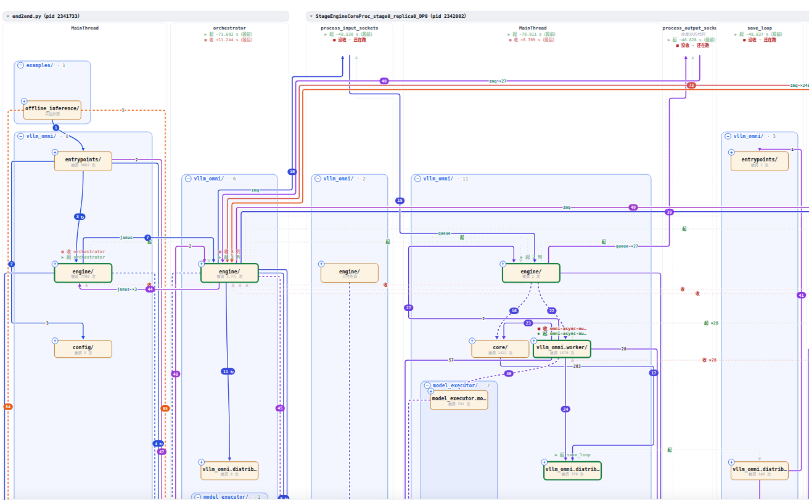
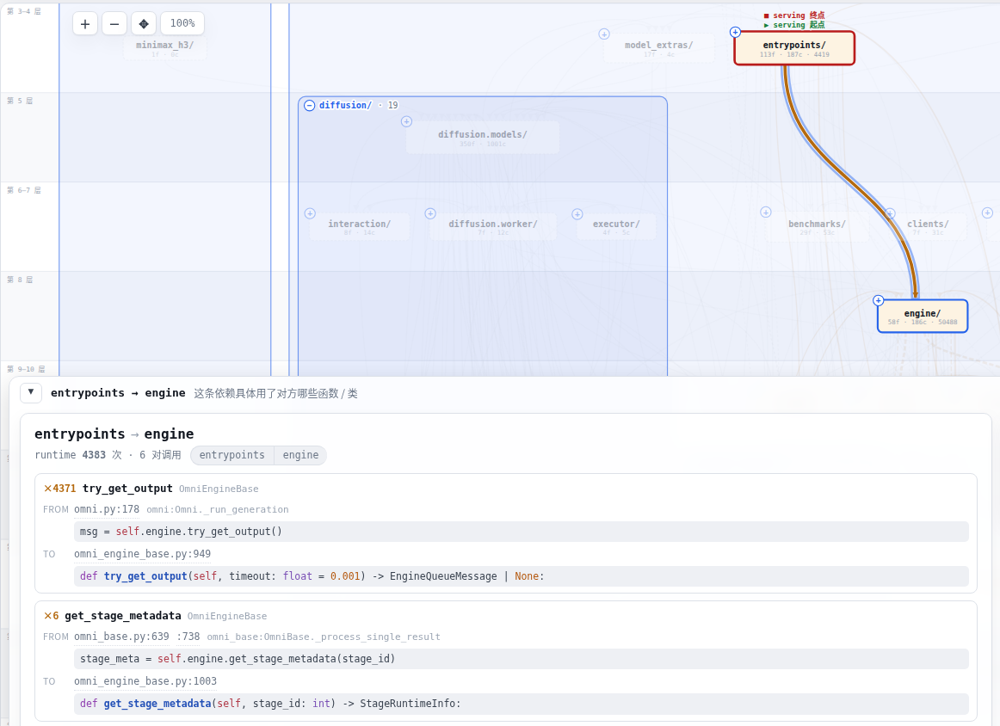
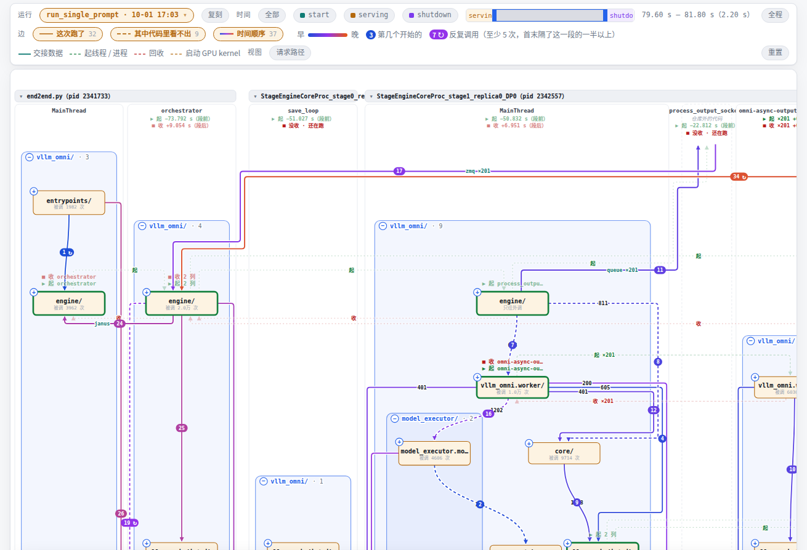
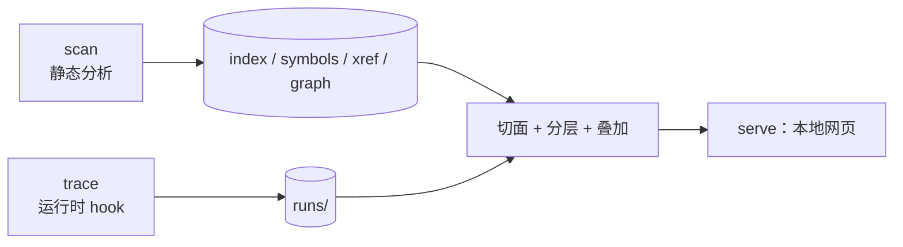

# codestrata

**仓库的运行路径工具：跑一次，看清这次运行在一个陌生的大仓库里走了哪条路、按什么顺序。**

codestrata 先静态扫描出一张模块之间的调用图（按 import 关系分层），再把一次真实运行（脚本、pytest、起服务的 sh 都行）录下来的调用叠到同一张图上，在本机浏览器里看。每次录制都永久保存，可以随时叠上去。适合接手一个大仓库、想知道「一次请求 / 一次推理到底经过了哪些模块、按什么顺序」的时候用。



<sub>vllm-omni 的模块图，叠上一次 MiniCPM 请求的 serving 阶段：调用方在上、被调用的在下；灰线是代码里写的调用，橙线是这次跑到的、边上是次数，橙虚线是代码里看不出会调到的。</sub>

> [!IMPORTANT]
> 早期版本（0.1.0）。目前只支持 **Python** 仓库；运行记录的格式和叠加与语言无关，其他语言在计划中。
> **录制只支持 Linux**（别的系统上 `trace` 会直接说明并退出）；扫描、看图、查看别处录好的 run 在其他系统上也能用，但只在 Linux 上测过。
> 要 Python ≥ 3.10，没有必需的第三方依赖；`trace --events`（时间轴上的任意一段、「时间顺序」要用它）要求**被录的程序**跑在 Python 3.12+ 上。
> 所有服务只监听 `127.0.0.1`，在远程机器上用要走 `ssh -L`。

## 亮点

- **静态和运行时在同一张图上。** 图上的边只有函数之间的调用：代码里写了的，和这次真的发生了的；这次跑了、代码里却看不出会调到它的（多态的 `self.model`、注册表、回调、框架转了一道）画成虚线，正好照出静态分析的盲区。录制时记下每次调用写在哪一行，点开就能看到那一行，以及 scan 在那一行看到了什么。
- **录一次，一直用。** 每次录制存成一个 **run**，不覆盖旧的；代码改了，老 run 照样能叠。子进程、`setsid` 出去的服务、site-packages 里的代码都能录。
- **能看先后。** 按阶段（加载 / 处理请求 / 退出）或任意一段时间只看那一段；边按第一次被调用的先后编号。
- **层次是算出来的。** 按 import 关系自动分层，调用方在上、被调用的在下；大仓库先显示到目录树的某一层，能就地展开、收起。

## 快速上手

要 Python ≥ 3.10 和 git。下面拿 [flask](https://github.com/pallets/flask) 当例子，扫描和录制加起来不到 1 秒。录服务、分阶段、主菜单、完整的命令参考见 **[docs/usage.md](docs/usage.md)**。

```bash
# 1. 安装。别用 pip install codestrata：PyPI 上同名的包是别人的
#    [highlight] 带上 Pygments，代码才有颜色
python3 -m venv .venv && source .venv/bin/activate
pip install 'codestrata[highlight] @ git+https://github.com/noviorlu/codestrata'

# 2. 拿一个仓库，静态扫描。pip install -e . 是给第 3 步用的：录的命令得能 import 这个仓库
git clone --depth 1 https://github.com/pallets/flask && cd flask
pip install -e .
codestrata scan

# 3. 录一次真实运行：-- 后面是你平时跑它的命令，在仓库根目录执行
#    --case 给这次录制起个名字；--events 多录调用的先后（被录的 Python 要 3.12+）
codestrata trace --case hello --events -- python -c "
from flask import Flask, jsonify
app = Flask('demo')
@app.route('/hi/<name>')
def hi(name): return jsonify(msg='hi ' + name)
c = app.test_client()
for n in ('a','b','c'): print(c.get('/hi/'+n).json)
"

# 4. 打开图，叠上这次运行。--hot 后面写 case 名，取它最近一次录完的（8900 端口被占就加 --port N）
codestrata serve --hot hello      # 浏览器打开 http://127.0.0.1:8900/
```

打开页面会看到 22 个节点按依赖分成几层，这次请求走过的边是橙色；点一条橙色的边，再点页面底部的「详情」栏，能看到这条边上调了对方哪些函数、各几次。
serve 开着时再录的 run，页面上方「运行」菜单里直接能选。不想敲命令，可以用 `codestrata app` 在浏览器里点按钮完成扫描、录制和打开图。
scan 和 trace 的产物都写在被分析仓库的 `.codestrata/` 里（自带 `.gitignore`）。

## 读图须知

运行时的图会误导人，看之前先知道这几条（叠着 run 时页面上工具栏下面也有一行）：

- **「调用方」是最近的一个仓库内的函数。** 穿过框架、事件循环、库里回调的调用，会显示成仓库内两个函数之间的直接调用。
- **次数高的多半是轮询**，不等于重要；一直在反复调用的边在「时间顺序」里带 ↻。
- **import 时执行模块顶层代码不算调用**，只被 import、一个函数都没被调过的模块不算「跑到了」。
- **「代码里看不出」有假阳性。** 类型其实写得清楚、只是 scan 不推的（`self.x = C(...)` 之后的 `self.x.m()`）、模块级 `__getattr__` 懒加载、用 property 时接收者的类型定不下的，也会画成虚线；边详情里写明 scan 在那一行看到的是什么。

## 重点功能

### 一张图，两层数据

页首那张图就是主界面。**底下一层是代码里写的调用**：每个节点是一个模块或目录，纵向按 import 关系分成一条条横带（**泳道**）。仓库大时图上只画目录树的一个**切面**，默认最多 80 个节点；点节点左上角的 ＋ 就地展开成框，框头的 − 收回去。**上面一层是某次运行**：

| 图上 | 意思 |
|---|---|
| 灰实线 | 代码里写了的调用，这次没录到（没叠运行时就是全部） |
| 橙实线 | 这次真的调用过；粗细不变，边上标调用次数 |
| 橙虚线 | 这次跑了，但代码里看不出会调到它 |

只 import、只读常量、只写在类型标注里的都不是调用，不成边。

叠了运行之后，分层按这次实际的调用重排，「这次走了哪条路」从上往下读就是。

### 点一条边：这条边上是谁调了谁



底部的详情栏按「哪个函数调了哪个」列出这条边上的调用：各几次，调用写在调用方的哪一行（录制时记下的），被调函数的定义。代码里看不出的标出来，并说明 scan 在那一行看到了什么——只知道写的名字、写的是基类的方法、这一行调的是别的函数（经它转了一道）、还是什么调用都没看到。上图里 MiniCPM 的 TTS `forward` 在第 1153 行 `return self.tts_model(…)`，经 torch.compile 调进了 `patch.py` 里打的补丁 724 次；scan 只知道名字 `tts_model`。见[边的种类](docs/usage.md#边的种类)。

### 时间轴：只看某一段时间



- **阶段**：`--phase serving=模块:函数` 表示这个函数第一次被调到时进入 serving 阶段，不用改被录的脚本；页面「时间」一行点一下只看那一段。
- **时间段**：录了 `--events` 的 run，还能在时间条上拖出任意一段。
- **时间顺序**：「边」一行里的开关，跑到的边按第一次被调用的先后编号 1…N。

### 其他功能

- **读代码**：从图上点进任意文件打开全文窗口，符号大纲、语法高亮、Ctrl+点击跳定义 / 列引用、Ctrl+F 查找，也能一键在本机编辑器打开（截图见 [读代码](docs/usage.md#读代码)）。
- **复刻**：每个 run 存下原样的命令、所在目录和相关环境变量，一键复制就能再录一次。见[管理 run](docs/usage.md#管理-run)。
- **主菜单**：`codestrata app` 在浏览器里选文件夹、点按钮扫描、录制、打开图。见[主菜单](docs/usage.md#主菜单-codestrata-app)。

## 它是怎么做到的

静态和运行时两份数据分开存、显示时才合并：静态分析随时能重做，运行记录只有一份、永久保留。



1. **静态分析。** 用标准库的 `ast` 解析每个 `.py`，记下谁 import 谁、类和函数在哪、每个函数在哪一行调了谁（名字解析和 Ctrl+点击同一套；定不下被调方的只记写的名字）。
2. **分层。** 先去掉循环依赖里最轻的边，再按最长依赖链排层（Eades–Lin–Smyth 贪心去环 + 最长路分层）；叠了运行时，按这次的调用重排。
3. **录制。** 往 `PYTHONPATH` 塞一个 `sitecustomize.py`，命令起的**每个** Python 进程都自动挂上 hook。3.12+ 用 `sys.monitoring`，仓库外的代码第一次命中就关掉回调；只记仓库内函数之间的调用。
4. **叠加。** 打开时才按「文件:行号 + 函数名」把次数对回**当前**代码，函数挪了几行也对得上；再按调用写在哪一行和静态分析对：那一行代码里定下的被调方就是它（构造 `C(…)` 跑的是沿继承找到的 `__init__`，也算），两边都有，否则就是代码里看不出。

代码结构和数据格式见 [docs/ARCHITECTURE.md](docs/ARCHITECTURE.md)、[docs/design/run-format.md](docs/design/run-format.md)。

## 实测

Intel Core i9-14900KF、Ubuntu 24.04、Python 3.12.3；scan 只用一个核。

| 仓库 | 扫描的 `.py` 文件 / 行数 | `scan` 用时 | 默认切面 |
|---|---|---|---|
| flask | 24 / 9.5k | 0.17 s | 22 个节点 |
| gsplat | 125 / 40.7k | 0.64 s | 53 个节点 |
| nerfstudio | 203 / 47.6k | 1.00 s | 35 个节点 |
| vllm-omni（`vllm_omni/` 包） | 1,648 / 590k | 12.8 s | 60 个节点 |

`trace` 每次仓库内调用约多花 1 µs：flask 测试客户端发 9000 个请求（65 万次仓库内调用）慢 1.36 倍，仓库外的代码几乎不花成本。`--events` 录完要整理事件，调用密的程序整理时间可能比程序本身还长。测法和完整数字见 [docs/usage.md](docs/usage.md#实测数字)。

## 已知限制

- **只支持 Python**：pybind、`torch.ops` 这类跨语言的调用看不到。
- **录制只支持 Linux**：它靠 `/proc` 认进程、找出 setsid 出去的服务并停干净。3.10 / 3.11 能录但没有 `--events`，仓库外的代码也要付回调的开销。
- **跳转保守、没有类型推断**：`x = Foo(); x.bar()` 不给跳。
- **重新 scan 之后要重启 serve**（新录的 run 不用重启）。
- **trace 注入的 `sitecustomize.py` 会遮住环境里原有的 `sitecustomize`**，依赖它的程序在录制时行为可能不同。
- **run 不能重建**：`.codestrata/runs/` 是唯一一份，删了就没了。
- **自动测试都在 CPU 上的假服务上跑**，没在 GPU 录制上验收过。

完整列表见 [docs/usage.md](docs/usage.md#已知限制)。

## 和其他工具的区别

- **OpenGrok / Sourcegraph / Hound / Zoekt** 给的是搜索和交叉引用，不知道一次运行实际走了哪条路。
- **Sourcetrail** 2021 年已归档；还在维护的 fork NumbatUI 明确禁用了 Python 索引。
- **profiler（cProfile、py-spy）** 告诉你时间花在哪，但不把调用放回仓库的架构里，也看不出调用的先后。

## 致谢

分层用的是 Eades、Lin、Smyth 的贪心去环启发式；源码高亮用 [Pygments](https://pygments.org/)。

## License

MIT，见 [LICENSE](LICENSE)。
