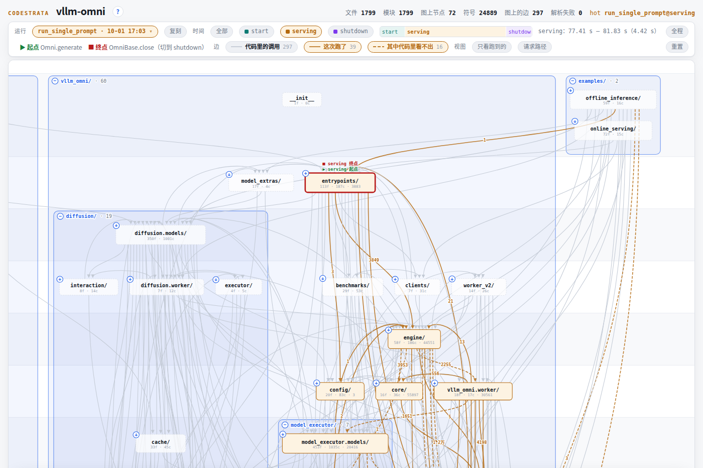
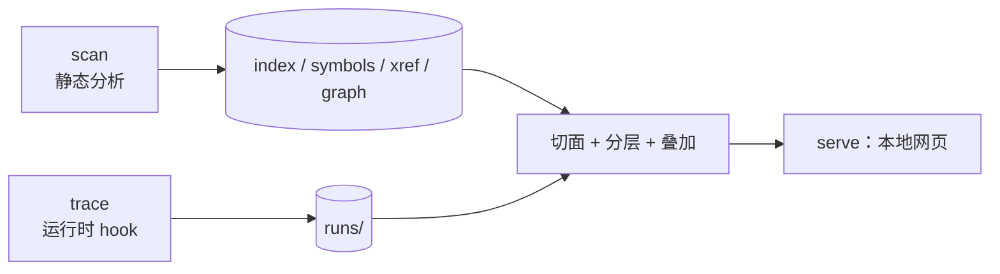

# codestrata

**仓库的运行路径工具：跑一次，看清这次运行在一个陌生的大仓库里走了哪条路、按什么顺序。**

codestrata 先静态扫描出一张模块之间的调用图（按 import 关系分层），再把一次真实运行（脚本、pytest、起服务的 sh 都行）录下来的调用叠到同一张图上，在本机浏览器里看。每次录制都永久保存，可以随时叠上去。适合接手一个大仓库、想知道「一次请求 / 一次推理到底经过了哪些模块、按什么顺序」的时候用。


<sub>vllm-omni 一次 MiniCPM 请求的 serving 阶段（开了「时间顺序」）：每个进程里每类线程一列，列里是这条线程调到的模块；列之间的线是交接数据（janus 队列、ZMQ、queue）、谁起了谁、谁回收了谁，序号是第一次发生的先后（蓝早、红晚）。</sub>

> [!IMPORTANT]
> 早期版本（0.1.0）。**Python 仓库**是全功能的；C / C++ / CUDA 文件装了 `[native]` 也能进静态图（函数、kernel、按名字近似地对上的调用），`trace --gpu` 把 GPU kernel 挂到发起它的 Python 调用上（要带 CUPTI 的 CUDA 12+ 工具链，真录只在 CUDA 13 上验收过）。
> **录制只支持 Linux**（别的系统上 `trace` 会直接说明并退出）；扫描、看图、查看别处录好的 run 在其他系统上也能用，但只在 Linux 上测过。
> 要 Python ≥ 3.10，没有必需的第三方依赖；时序事件（请求路径、时间轴上的任意一段、「时间顺序」要用它，`trace` 默认录）要求**被录的程序**跑在 Python 3.12+ 上。录大框架也建议 3.12+：3.10 / 3.11 能录，但仓库外的代码也会变慢，可能慢一个数量级（见[已知限制](#已知限制)）。
> 所有服务只监听 `127.0.0.1`，在远程机器上用要走 `ssh -L`。

## 亮点

- **静态和运行时在同一张图上。** 图上的边只有函数之间的调用：代码里写了的，和这次真的发生了的；这次跑了、代码里却看不出会调到它的（多态的 `self.model`、注册表、回调、框架转了一道）画成虚线，正好照出静态分析的盲区。录制时记下每次调用写在哪一行，点开就能看到那一行，以及 scan 在那一行看到了什么。
- **录一次，一直用。** 每次录制存成一个 **run**，不覆盖旧的；代码改了，老 run 照样能叠。子进程、`setsid` 出去的服务、site-packages 里的代码都能录。
- **多进程、多线程分开看。** 录了时序事件的 run 按进程 · 线程分列：每条线程调到的模块一列，列之间画出交接数据（队列、ZMQ）、谁起了谁、谁回收了谁，两头标出那一行代码；点开的详情只讲这一列。
- **能看先后。** 按阶段（加载 / 处理请求 / 退出）或任意一段时间只看那一段；边和线程之间的交接按第一次发生的先后编号。
- **层次是算出来的。** 按 import 关系自动分层，调用方在上、被调用的在下；大仓库先显示到目录树的某一层，能就地展开、收起。

## 快速上手

要 Python ≥ 3.10 和 git。下面拿 [flask](https://github.com/pallets/flask) 当例子，扫描和录制加起来不到 1 秒。录服务、分阶段、主菜单、完整的命令参考见 **[docs/usage.md](docs/usage.md)**。

```bash
# 1. 安装。别用 pip install codestrata：PyPI 上同名的包是别人的
#    [highlight] 带上 Pygments，代码才有颜色
python3 -m venv .venv && source .venv/bin/activate
pip install 'codestrata[highlight] @ git+https://github.com/noviorlu/codestrata'

# 2. 拿一个仓库，静态扫描。pip install -e . 是给第 3 步用的：录的命令得能 import 这个仓库
git clone --depth 1 https://github.com/pallets/flask && cd flask
pip install -e .
codestrata scan

# 3. 录一次真实运行：-- 后面是你平时跑它的命令，在仓库根目录执行
#    --case 给这次录制起个名字；被录的 Python 是 3.12+ 时还会录下调用的先后（--no-events 不录）
codestrata trace --case hello -- python -c "
from flask import Flask, jsonify
app = Flask('demo')
@app.route('/hi/<name>')
def hi(name): return jsonify(msg='hi ' + name)
c = app.test_client()
for n in ('a','b','c'): print(c.get('/hi/'+n).json)
"

# 4. 打开图，叠上这次运行。--hot 后面写 case 名，取它最近一次录完的（8900 端口被占就加 --port N）
codestrata serve --hot hello      # 浏览器打开 http://127.0.0.1:8900/
```

被录的 Python 是 3.12+ 时（时序事件默认录），图按线程分列：这个例子只有一条主线程，就是一列，列里是这次调到的 flask 模块，边上是次数；点一条橙色的边，页面底部的「详情」栏自动打开，列出这条边上调了对方哪些函数、各几次（分列里的详情只算这一列）。没录时序事件的 run（3.10 / 3.11，或加了 `--no-events`）是一张按依赖分层的模块图（默认只画这次跑到的模块；flask 整个仓库的默认切面是 22 个节点），点了边之后详情栏不会自己打开，收着时再点一下页面底部的「详情」栏。
serve 开着时再录的 run，页面上方「运行」菜单里直接能选。不想敲命令，可以用 `codestrata app` 在浏览器里点按钮完成扫描、录制和打开图。
scan 和 trace 的产物都写在被分析仓库的 `.codestrata/` 里（自带 `.gitignore`）。

## 读图须知

运行时的图会误导人，看之前先知道这几条（叠着 run 时页面上工具栏下面也有一行）：

- **「调用方」是最近的一个仓库内的函数。** 穿过框架、事件循环、库里回调的调用，会显示成仓库内两个函数之间的直接调用。
- **次数高的多半是轮询**，不等于重要；一直在反复调用的边在「时间顺序」里带 ↻。
- **import 时执行模块顶层代码不算调用**，只被 import、一个函数都没被调过的模块不算「跑到了」。
- **「代码里看不出」有假阳性。** scan 只推构造和类型标注写明的类型：没标返回值类型的工厂造出来的对象（`self.x = make()` 之后的 `self.x.m()`）、模块级 `__getattr__` 懒加载、用 property 时接收者的类型定不下的，也会画成虚线；标注写的是基类或 Protocol、跑的是子类或实现的，也算看不出。边详情里写明 scan 在那一行看到的是什么。

## 重点功能

### 一张图，两层数据



<sub>没按线程分的模块图（叠的 run 没录时序事件，或者没叠 run）：调用方在上、被调用的在下；灰线是代码里写的调用，橙线是这次跑到的、边上是次数，橙虚线是代码里看不出会调到的。叠了 run 默认只画跑到的模块（「只看跑到的」），这张关掉了它，看得到全图。录了时序事件的 run 一律按线程分列（下面几张图用的就是这个 run），所以这张是在一份拷贝上删掉了它的时序事件（`runs rm --events-only`）再叠的。</sub>

**底下一层是代码里写的调用**：每个节点是一个模块或目录，纵向按 import 关系分成一条条横带（**泳道**）。仓库大时图上只画目录树的一个**切面**，默认最多 80 个节点；点节点左上角的 ＋ 就地展开成框，框头的 − 收回去。**上面一层是某次运行**：

| 图上 | 意思 |
|---|---|
| 灰实线 | 代码里写了的调用，这次没录到（没叠运行时就是全部） |
| 橙实线 | 这次真的调用过；粗细不变，边上标调用次数 |
| 橙虚线 | 这次跑了，但代码里看不出会调到它 |

只 import、只读常量、只写在类型标注里的都不是调用，不成边。

### 多线程 / 多进程：按线程分列，每列自己的切面


<sub>orchestrator 这一列里展开了 `engine/`：和模块图一样画成一个框，框头写名字、框里几个模块；旁边两列的 `engine/` 还是收着的一个节点。连线是跨线程 / 跨进程的交接（ZMQ、队列、谁起了谁）。</sub>

叠了录了时序事件的 run（3.12+ 默认录），运行时的图按**进程 · 线程分成并排的几列**：每列是这条线程调到的模块，同一个模块在几列里
各有一份、横着对齐，鼠标停在一份上连到别的列里的它；列之间画出谁起了谁、谁回收了谁（join / waitpid）、谁把数据交给谁（janus / ZMQ / queue……）。起线程、回收线程的节点
像阶段的起点 / 终点那样标成绿 / 红，列头写这条线程什么时候起、什么时候收（或者没人收）；点一条连线，两头标出那一行代码（`t.start()`、`q.put(x)`……）。
**每一列能各自展开 / 收起自己的切面**：点 ＋ 只换这一列的子模块，别的线程、别的进程不变；展开的目录和模块图一样画成框，框头的 − 只收起这一列里的它。
**点开的详情只讲这一份**：选中一列里的节点或边，次数、调用了谁、文件树里哪些函数跑过，都只算这一列（这条线程）里的调用。
vllm-omni 的一次请求读得出 main → orchestrator → 各 stage 的收请求线程 → 主循环 → 输出线程 → 回到 orchestrator 这条交接。
没录时序事件的 run 没有线程的信息，画成一张：只画这次跑到的模块，分层按这次实际的调用重排（「只看跑到的」关掉回全图）。见[按进程 · 线程分列](docs/usage.md#按进程--线程分列叠了录了时序事件的-run-就是它)。

### 点一条边：这条边上是谁调了谁


底部的详情栏按「哪个函数调了哪个」列出这条边上的调用：各几次，调用写在调用方的哪一行（录制时记下的），被调函数的定义。代码里看不出的标出来，并说明 scan 在那一行看到了什么——只知道写的名字、写的是基类的方法、这一行调的是别的函数（经它转了一道）、还是什么调用都没看到。上图是分列里 stage1 主线程那一列的这条边（详情只算这一列）：MiniCPM 的 TTS 在 `sample` 里第 1206 行 `output = Sampler()(logits, sampling_metadata)`，经仓库外的 vLLM 采样器调进了 `patch.py` 换上去的 `random_sample`（它替换了 vLLM 的采样函数）249 次；scan 在那一行只看到仓库外的 `Sampler` 和一个定不下的调用。见[边的种类](docs/usage.md#边的种类)。

### 时间轴：只看某一段时间


<sub>拖出 serving 的后半段（79.60 – 81.80 s）：图上只画这段时间里跑过的线程，stage0 这时只剩 save_loop，stage1、stage2 在把输出送回 orchestrator。打开「时间顺序」后，列里的边和列之间的交接按第一次发生的先后编号：11 是 stage1 的 MainThread 经 queue 交给 process_output_sockets（×201），17 是它再经 zmq 发给 orchestrator（×201）；带 ↻ 的是这段时间里一直在反复的，比如 34↻ 是 stage2 经 zmq 发给 orchestrator（×9）。</sub>

- **阶段**：`--phase serving=模块:函数` 表示这个函数第一次被调到时进入 serving 阶段，不用改被录的脚本；页面「时间」一行点一下只看那一段。
- **时间段**：录了时序事件的 run（3.12+ 默认录），还能在时间条上拖出任意一段。
- **时间顺序**：「边」一行里的开关，列里的边和线程之间的交接放在一起，跨线程按第一次发生的先后编号 1…N。
- **请求路径**：不用一条条点边，直接列出这一段里每个进程、每个线程按第一次调用的先后排的函数级调用树，每一跳写着调用在哪一行（页面上「请求路径」，或 `codestrata path <repo> <RUN>@serving`）。见[请求路径](docs/usage.md#请求路径视图一行的请求路径或-codestrata-path)。

### 其他功能

- **读代码**：从图上点进任意文件打开全文窗口，符号大纲、语法高亮、Ctrl+点击跳定义 / 列引用、Ctrl+F 查找，也能一键在本机编辑器打开（截图见 [读代码](docs/usage.md#读代码)）。
- **复刻**：每个 run 存下原样的命令、所在目录和相关环境变量，一键复制就能再录一次。见[管理 run](docs/usage.md#管理-run)。
- **主菜单**：`codestrata app` 在浏览器里选文件夹、点按钮扫描、录制、打开图。见[主菜单](docs/usage.md#主菜单-codestrata-app)。

## 它是怎么做到的

静态和运行时两份数据分开存、显示时才合并：静态分析随时能重做，运行记录只有一份、永久保留。



1. **静态分析。** 用标准库的 `ast` 解析每个 `.py`，记下谁 import 谁、类和函数在哪、每个函数在哪一行调了谁（名字解析和 Ctrl+点击同一套，接收者的类型按构造和类型标注推；定不下被调方的只记写的名字）。
2. **分层。** 先去掉循环依赖里最轻的边，再按最长依赖链排层（Eades–Lin–Smyth 贪心去环 + 最长路分层）；叠了运行时，按这次的调用重排。
3. **录制。** 往 `PYTHONPATH` 塞一个 `sitecustomize.py`，命令起的**每个** Python 进程都自动挂上 hook。3.12+ 用 `sys.monitoring`，仓库外的代码第一次命中就关掉回调；只记仓库内函数之间的调用。
4. **叠加。** 打开时才按「文件:行号 + 函数名」把次数对回**当前**代码，函数挪了几行也对得上；再按调用写在哪一行和静态分析对：那一行代码里定下的被调方就是它（构造 `C(…)` 跑的是沿继承找到的 `__init__`，也算），两边都有，否则就是代码里看不出。

代码结构和数据格式见 [docs/ARCHITECTURE.md](docs/ARCHITECTURE.md)、[docs/design/run-format.md](docs/design/run-format.md)。

## 实测

Intel Core i9-14900KF、Ubuntu 24.04、Python 3.12.3；scan 只用一个核。

| 仓库 | 扫描的 `.py` 文件 / 行数 | `scan` 用时 | 默认切面 |
|---|---|---|---|
| flask | 24 / 9.5k | 0.17 s | 22 个节点 |
| gsplat | 125 / 40.7k | 0.64 s | 53 个节点 |
| nerfstudio | 203 / 47.6k | 1.00 s | 35 个节点 |
| vllm-omni（`vllm_omni/` 包） | 1,648 / 590k | 12.8 s | 60 个节点 |

`trace` 每次仓库内调用约多花 1 µs（只记次数）；默认还录时序事件，每次调用再多约 1.2 µs，录完要把事件整理成 span——60 万次调用整理约 8 秒（`tests/bench/events_overhead.py`，2026-10-08 复测）。仓库外的代码几乎不花成本（3.12+；3.10 / 3.11 上不是，见下面）。调用很密的程序可以加 `--no-events`：只记次数，没有分列、请求路径和时间顺序。测法和完整数字见 [docs/usage.md](docs/usage.md#实测数字)。

## 已知限制

- **运行时只录 Python 函数**（和 `--gpu` 时的 GPU kernel）：pybind、`torch.ops`、ctypes 调进去的 C / C++ 函数看不到；C / C++ / CUDA 的静态图是按名字近似地对上的。
- **录制只支持 Linux**：它靠 `/proc` 认进程、找出 setsid 出去的服务并停干净。
- **被录的程序最好跑在 Python 3.12+ 上**：3.10 / 3.11 能录，但没有时序事件（请求路径、时间顺序看不了），而且仓库外的代码每次调用也要回调一次（`sys.setprofile`）。实测一个只调标准库的循环在 3.11 / 3.10 上慢 3.4 / 4.7 倍，几乎全在标准库纯 Python 代码里的循环（`ast.walk`）慢 7.9 / 11 倍，3.12 上这两种都是 1.0 倍；仓库内的调用各版本都是每次约多 1 µs。torch、vLLM 这类大框架大部分时间花在仓库外的 Python 代码里，3.10 / 3.11 上可能慢一个数量级。
- **跳转保守，类型只推代码里写明的**（构造、类型标注、返回值标注）：`x = make(); x.bar()`（`make` 没标返回值类型）不给跳。
- **重新 scan 之后要重启 serve**（新录的 run 不用重启）。
- **trace 注入的 `sitecustomize.py` 会遮住环境里原有的 `sitecustomize`**，依赖它的程序在录制时行为可能不同。
- **run 不能重建**：`.codestrata/runs/` 是唯一一份，删了就没了。
- **自动测试大多在 CPU 上的假服务上跑**；GPU 录制只在一台 RTX 5090（CUDA 13）上真录验收过，录制端对着 CUDA 12 和 13 的 CUPTI 头都编过。

完整列表见 [docs/usage.md](docs/usage.md#已知限制)。

## 和其他工具的区别

- **OpenGrok / Sourcegraph / Hound / Zoekt** 给的是搜索和交叉引用，不知道一次运行实际走了哪条路。
- **Sourcetrail** 2021 年已归档；还在维护的 fork NumbatUI 明确禁用了 Python 索引。
- **profiler（cProfile、py-spy）** 告诉你时间花在哪：cProfile 给每个函数的累计次数和时间，py-spy 采样（能出火焰图和时间线）；都不记调用的先后、哪条线程把数据交给了哪条，也不和静态扫描的结果对照。
- **函数级的时间线（viztracer + Perfetto）** 记下每次调用和先后、多线程多进程，是按时间看的；codestrata 把这次的调用放回仓库的模块上，按调用行和静态扫描对照（哪些代码里看不出），把线程、进程之间的交接配对连起来，run 跟着代码改动挪。
- **静态调用图（pyan、code2flow）** 只有代码里写的那一半；**Nsight Systems、torch.profiler** 看 GPU 时间线和 CUDA API 上的调用栈，不把 kernel 落到仓库的结构上。

## 致谢

分层用的是 Eades、Lin、Smyth 的贪心去环启发式；源码高亮用 [Pygments](https://pygments.org/)。

## License

MIT，见 [LICENSE](LICENSE)。
