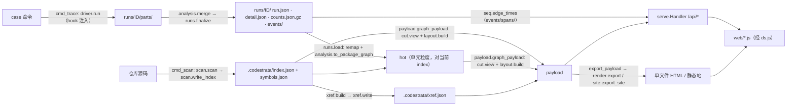

# 架构

代码怎么组织、数据怎么流，只写现状。定位和已知问题见 `docs/STATUS.md`；行数是 2026-09-29 的 `wc -l`。

## 组成

codestrata 是一个纯标准库的 Python 包（源码高亮用可选的 Pygments）加一套不需要构建的前端，分四部分：
**静态扫描**（`scan`、`xref`：把仓库变成 `.codestrata/` 下可重建的索引）；**录制**（`trace`、`runs`、`events`：跑一条真实命令，
存成 `.codestrata/runs/<id>/` 下不可重建的 run）；**组装与交付**（`payload` 把索引和 run 拼成前端数据，`serve` 按请求给，
`render` / `site` 导出成文件；`cut`、`layout`、`seq`、`highlight`、`notes` 是零件）；**前端**（`codestrata/web/`）。
主菜单 `codestrata app`（`app`、`projects`、`jobs`、`viewers`）站在外面，替人敲 `scan` / `trace` / `serve` 命令，不直接调它们的函数。

## 数据流



1. **scan**：`__main__.cmd_scan` 调 `scan.scan(repo, roots=…)`（`ast` 遍历选定目录的 .py），`scan.write_index` 写出
   `index.json`（单元 `packages`、import 边 `edges` / `type_edges`、目录树 `dirs`、`cut.default_open` 算的默认切面）和
   `symbols.json`（`symbols`、`files`、`edge_uses`、`file_sha` 等），紧接着 `xref.build` + `xref.write` 写同一时刻的 `xref.json`。
2. **layout（分层）**：不落盘，每次请求现算。`cut.view(idx, open_)` 把文件级单元汇总到当前切面的节点上，
   `layout.layers` 按依赖分层（去环后最长路，边尽量往下指），`layout.build` 排出节点和框的坐标。
3. **trace**（`codestrata/trace/` 包）：`cmd_trace` 先用 `analysis.resolve_phase_at` 解析 `--phase`，`runs.new_run` 建 run 目录和 `run.json`，再交给
   **driver** `driver.run`：`hook.make_bootstrap` 把 **hook** `_SITECUSTOMIZE` 写成临时目录里的 `sitecustomize.py` 插到
   `PYTHONPATH` 最前面，经 `CODESTRATA_ROOT` / `CODESTRATA_OUT` / `CODESTRATA_EVENTS` / `CODESTRATA_PHASE_AT` 等环境变量配置，
   命令在自己的会话里跑。每个 Python 进程映像往 `parts/` 写 `part-<pid>-<t0ns>.json`（`funcs`、`func_edges`、`names`、
   文件哈希），`--events` 时另写 `ev-<pid>-<t0ns>.log`。停止按 `_levels()`（SIGINT → SIGTERM → SIGKILL）逐级升级，
   `stop_leftovers` 停残留进程，最后 `analysis.merge` 合并分片，经 `after` 回调收尾。
4. **run**：`runs.finalize` → `capture`（case 脚本、配置文件、环境、git → `detail.json`）→ `_pack_all`（`parts.tar.gz`、
   `events/raw.tar.gz`）→ `_build_events`（`events.build` → `events/spans/`）→ `derive`（`counts.json.gz`：各阶段的
   `funcs` / `func_edges` 和 `names`；定状态）。派生数据可由 `runs merge`（`runs.merge_run`）从原始数据重算。
5. **映射回当前 index**：`runs.resolve(repo, ref)` 解析 run id / case 名 / `@阶段` / `@t=起-止`；`runs.load` 读计数（`load_counts`，
   时间段则 `seq.window_counts`），`file_state` 拿录制时的文件哈希和 index 的 `file_sha` 比，`remap` 把改过的文件里的键按 qualname
   挪到函数现在的行号，`analysis.to_package_graph(counts, idx)` 折算到单元粒度，返回 `(hot, meta)`。所以代码改了之后老 run 照样能叠。
6. **payload**：`payload.load_index` 合并 index.json 和 symbols.json；`graph_payload` 做切面（`cut.view`）、
   叠加（`_hot_on_cut`，对比时 A、B 各一次，返回里带 `cmp`）、排版（`layout.build`）。边详情 `edge_detail` /
   `edge_compare`，源码 `file_view` / `symbol_source`（经 `highlight`），跳转 `xref_for` / `refs`，`search_index`、`reveal`。
7. **交付**：`serve.main` 启动时读一次 index；`serve.Handler` 按请求调 payload（`_hot` 按 run id、阶段、文件 mtime 缓存 8 个），
   `/api/seq/edges` 交给 `seq.edge_times`（读 `events/spans/`，只有 serve 有）。`cmd_graph` 调 `payload.export_payload`，由
   `render.export` 内联成单文件（`window.CS_EMBEDDED`），`--link github` 时由 `site.export_site` 写静态站（源码从 GitHub 取）。
8. **前端**：`web/ds.js` 决定数据从哪来，其余脚本不感知（见「前端结构」）。

## 模块地图

| 模块 | 行 | 职责 |
|---|---:|---|
| `__init__.py` | 8 | `self_command`：用当前 Python 跑 codestrata 的命令行前缀 |
| `compat.py` | 54 | 平台差异：能不能录（只支持 Linux）、跨平台的文件锁 |
| `__main__.py` | 784 | CLI 分派；`cmd_scan` 串 scan + xref，`cmd_trace` 把 `runs` 和 `trace` 缝起来 |
| `scan.py` | 806 | `ast` 静态扫描：单元、import 边、符号、目录树，写 index.json / symbols.json |
| `xref.py` | 1401 | 交叉引用（名字 → 定义），写 xref.json，给 Ctrl+点击 |
| `cut.py` | 288 | 目录树切面：哪些目录展开、单元落在哪个节点、默认切面 |
| `layout.py` | 629 | 依赖分层 + 横向排序 + 框，出坐标 |
| `trace/hook.py` | 657 | 注入被测进程的那段源码（`_SITECUSTOMIZE`）、`make_bootstrap`、和 driver 约定的环境变量名；不 import codestrata 的任何东西 |
| `trace/driver.py` | 391 | 在外面跑命令（`run`）、三级停进程、扫 `/proc` 找残留（`leftovers`、`stop_leftovers`）；只支持 Linux |
| `trace/analysis.py` | 515 | 录之前解析 `--phase`（`resolve_phase_at`），录完之后合并分片（`merge`）、折算到当前 index（`to_package_graph`、`sym_locs`、`defining`）、找 case 脚本；纯数据处理 |
| `runs.py` | 1062 | run 目录的建、收尾、迁移、解析、加载（`remap`、`file_state`）、管理、复刻命令 |
| `events.py` | 240 | 时序事件日志 → span（`events/spans/`） |
| `seq.py` | 327 | span → 当前切面上每条边的首末调用时刻（「时间顺序」）、阶段区间、时间段计数 |
| `payload.py` | 1270 | 组装前端数据：图、叠加、对比、边详情、源码、引用、搜索、导出数据、公开化 |
| `highlight.py` | 186 | Pygments 服务端高亮（Python / Triton / C++ / CUDA）和大纲 |
| `notes.py` | 572 | 解读层：`notes/` 下的 Markdown、过期判定、任务、输入包、引用核对 |
| `serve.py` | 477 | 本地 HTTP：静态文件 + `/api/*`、安全检查、缓存；`BaseHandler` 给 app 复用 |
| `render.py` | 45 | 把 web/ 和 payload 内联成单文件 HTML |
| `site.py` | 351 | 静态站导出（源码从 GitHub 取，数据按需加载） |
| `app.py` | 385 | 主菜单 HTTP：路由、鉴权、`/v/<端口>/` 转发 |
| `projects.py` | 201 | 主菜单的数据：项目清单、状态、挑目录、函数补全 |
| `jobs.py` | 287 | 主菜单的后台任务（scan / trace 子进程）、`TraceSpec` 录制表单 |
| `viewers.py` | 158 | 主菜单给每个仓库起的 `codestrata serve` 子进程 |
| `web/ds.js` | 388 | 数据源层：live（fetch `api/*`）/ embedded / linked |
| `web/app.js` | 1055 | 入口：串起数据源、图、面板、run 选择、对比、时间轴 |
| `web/graph.js` | 683 | SVG 绘图（纯函数式），边的配色约定 |
| `web/panel.js` | 740 | 详情面板（事实 + 源码）和解读面板 |
| `web/viewer.js` | 463 | 全文窗口：大纲、Ctrl+点击跳转（`CS.xref`） |
| `web/findbar.js` | 238 | 全文窗口里的查找 |
| `web/search.js` | 337 | 搜索栏：模块、文件、类 / 函数 |
| `web/timebar.js` | 229 | 时间轴：阶段按钮 + 可拖的时间段 |
| `web/hl.js` | 314 | 浏览器端高亮（Pygments 词法表的 JS 版） |
| `web/home.js` | 389 | 主菜单页面（`home.html`，不走 ds.js） |

已知的结构问题（`docs/TODO.md` P2 里有对应条目）：
- **`payload.py` 是 god module**：同时认识事实（index）、runtime（经 `runs`）、坐标（`layout`）、源码（`highlight`）、
  交叉引用（`xref`）、解读（`notes`），还有自己的一段 `ast` 分析（`_code_facts`、`_call_form`）。
- 模块之间不用下划线开头的名字（`tests/test_package.py` 的 `test_no_cross_module_private_names` 盯着）。

## 语言无关 vs Python 专用

**语言无关**（只认 `文件:首行号` 键和单元 id，不认语法）：
- run 的存储：`run.json` / `detail.json` / `counts.json.gz`（各阶段 `funcs`、`func_edges`）、阶段日志 `phase_log`、
  `runs` 的建 / 收尾 / 解析 / 管理 / 复刻命令；`events.py` 的日志格式和 span；`seq.py` 的时间窗和边时刻。
- 切面和排版：`cut.py`（单元 id 是点分名；`unit_dir` 对 `.__init__` 的特判来自 Python 的包约定）、`layout.py`（只吃 id 和带权边）。
- 叠加、对比：`payload._hot_on_cut`、`graph_payload`、`edge_compare`；`trace/analysis.py` 的 `to_package_graph` / `sym_locs` / `defining`
  只依赖 symbols 表的字段（`f`、`l`、`dl`、`e`、`k`），「第 0 行 = 模块顶层」「落在类符号行 = 类体」是约定。
- `trace/driver.py` 的进程管理（会话、信号升级、残留进程），除了注入方式（见下）。
- 前端全部；`highlight.py` / `hl.js` 本来就认多种语言。

**Python 专用**：
- `scan.py`（`ast`、import 语义、`TYPE_CHECKING`、`__init__.py`、roots 探测）和 `xref.py`（`ast` 名字解析）。
- `trace/hook.py`（`_SITECUSTOMIZE`）：经 `sitecustomize` + `PYTHONPATH` 注入；3.12+ 用 `sys.monitoring`，否则
  `sys.setprofile` / `threading.setprofile`；记 `co_qualname`；拦 `os._exit` / `os.exec*`、`os.register_at_fork`；
  `CODESTRATA_PKGS` 把 site-packages 里的路径映射回仓库。时序事件只有 `sys.monitoring` 路径才录。
- `--phase` 的解析（`trace/analysis.py` 的 `resolve_phase_at`、`_qualnames`、`_inherited` 按 MRO 找方法）和 `case_script`。
- `runs.remap` 的细节：qualname 去掉 `.<locals>` 再对 symbols 表的 `(文件, 名字)`；`runs._dists` 读 `*.dist-info`。
- `payload` 里边详情的「调用处」：`_code_facts` / `_call_form` / `_add_call_sites` 按 Python 语法认调用写法。

加一门语言要提供：一个扫描器，产出同样结构的 index.json / symbols.json（单元、边、目录树、带 `f/l/dl/e/k/n` 的符号、`file_sha`），
xref.json 可选；一个录制端，在被测进程里往 `CODESTRATA_OUT` 写同格式的分片（和可选的事件日志），并有一种注入方式替代
`PYTHONPATH` + `sitecustomize`；最好再给出等价于 qualname 的名字供 remap。字段级契约见 [`docs/design/run-format.md`](design/run-format.md)。

## 前端结构

`codestrata/web/` 下是原样发布的静态文件，**没有构建步骤**：普通 `<script>`，每个文件是一个 IIFE，往 `window.CS`
上挂一个对象（`CS.ds`、`CS.graph`、`CS.findbar`、`CS.viewer` / `CS.xref`、`CS.panel`、`CS.search`、`CS.timebar`、`CS.hl`、`CS.app`）。

- **加载顺序**：`index.html` 末尾依次是 `hl.js`、`ds.js`、`graph.js`、`findbar.js`、`viewer.js`、`panel.js`、`search.js`、
  `timebar.js`、`app.js`（`app.js` 最后启动）。导出时 `render.SCRIPTS` 是同一顺序去掉 `hl.js`：`render.export` 把
  `hl.js` 单独放一个 `<script>`（它用了正则后行断言，老浏览器解析失败时只丢高亮）。`tests/test_package.py` 核对两份清单一致。
- **数据源层 `ds.js`**：UI 只调 `CS.ds.*`。有 `window.CS_EMBEDDED` 时是 embedded（只读、固定切面、没有时序数据），
  否则是 live（`fetch('api/…')`，地址都是相对的，经主菜单转发时页面在 `/v/<端口>/` 下）；embedded 且带 `EMB.link`
  时（`site` 导出）再用 `linkedDs` 换掉取源码、大纲、边、搜索、引用这几样。样式在 `app.css`。
- 主菜单是另一套页面 `home.html` + `home.js` + `home.css`，不走 ds.js，直接 fetch 主菜单的 `/api/*`。

## 测试

不依赖 pytest，每个文件自带运行器（`tests/common.py` 的 `run_tests`，后面跟几个词就只跑名字里带这些词的用例），
缺工具的自动跳过。提交前全跑（`CLAUDE.md`）：

```bash
.venv/bin/python tests/test_runs.py      # 约 1.5–2 分钟
.venv/bin/python tests/test_app.py
.venv/bin/python tests/test_package.py   # 要 uv
.venv/bin/python tests/test_web.py       # 要 node
.venv/bin/python tests/test_platform.py
.venv/bin/python tests/test_browser.py   # 要 node 22+ 和 Chrome / Chromium，约 15 秒
.venv/bin/python tests/hl_parity.py      # 只在动了高亮时跑；要 node
```

- `test_runs.py`（71 个用例）：在 `tests/trace_cases/fake_repo` 的 CPU 假服务上跑真的 trace。停进程（超时、中断、挂断、
  残留）、合并与重算、迁移、`--phase` 和阶段日志、复刻命令、时序事件和 `seq`、`remap`、类体 / 动态分派 / 调用处、
  对比和多 run 导出、公开导出和静态站、分层方向、`notes` 引用修复。
- `test_app.py`：主菜单的 `projects`、`jobs`、`app` HTTP（鉴权、扫描、录制、打开图）、serve 的安全检查，以及 scan 的 roots 选择。
- `test_package.py`：wheel 里带着 web/ 每个文件；`index.html` 的脚本清单和 `render.SCRIPTS` 一致；两条结构约束（录制三块的依赖方向、模块之间不用私有名）。
- `test_web.py`：用 node 跑前端纯函数（`findbar.find`、时间轴的吸附 / 缩放 / 标签）。
- `test_platform.py`：模拟没有 fcntl / SIGKILL、`sys.platform` 不是 Linux 的环境：所有模块能 import、scan / graph 能用、trace 拒绝且不建 run。
- `hl_parity.py`：`hl.js` 对拍 `highlight.py`，不是回归测试；默认语料含本机的 vllm-omni，别处要给目录参数。

- `test_browser.py` + `tests/web/`：headless Chrome 经 CDP 真的点、拖、按键。`cdp.mjs` 起 / 关浏览器，`run.mjs` 跑 `specs/*.mjs`
  （图、叠加、时间轴、时间顺序、对比、代码窗口、查找各一份）；数据是假服务当场录的两个 run（truth 带三个阶段、offline 给对比）。
  要 node 22+ 和 Chrome / Chromium，没有就跳过；约 15 秒。

## 平台

录制只支持 Linux：`cmd_trace` 一开始就调 `compat.require_trace()`，别的系统上说明并退出，不建 run 目录。平台差异都在 `compat.py`
（能不能录、跨平台的文件锁）；只有 Unix 才有的东西（`fcntl`、`signal.SIGKILL`）不在模块顶层取，所以别的系统上所有模块都能 import，
scan / serve / graph / runs 照常可用（`tests/test_platform.py` 模拟过）。录制为什么非 Linux 不可：hook 读 `/proc/self/stat|cmdline`（失败有退路）；
driver 用 `/proc/<pid>/stat|status|environ|cmdline` 认进程、找残留（`proc_start`、`_alive`、`_ignores`、`leftovers`），没有 `/proc`
时只停命令自己的进程组，setsid 出去的服务找不到；`os.killpg`、`start_new_session`、`os.register_at_fork`、`signal.SIGKILL` 在 Windows 上都没有。
