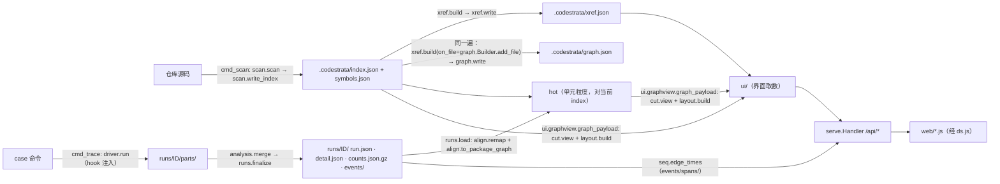

# 架构

代码怎么组织、数据怎么流。开头一节讲核心模型，现在的代码和它对不上的地方在那一节里标出来；其余各节只写现状。行数是 2026-09-30 的 `wc -l`。

## 核心模型：graph

codestrata 围着一个 graph 转：

- **节点**是函数（类、函数，键 `<路径>#<限定名>`），按文件、目录分组；
- **边**是函数 → 函数的调用（包括构造 `C(...)`）。每条边记两样：**scan 的记录**（代码里写了这个调用，写在哪几行）和 **trace 的记录**（这次运行真的发生了，几次、何时）。
  只 import、只读常量、只写在类型标注里的都不是调用，不成边。

三步：

| 步 | 做什么 | 现在的代码 |
|---|---|---|
| **scan** | 读代码，产出节点和边的 scan 记录 | `scan.py`、`xref.py` |
| **trace** | 录一次真实运行，得到边的 trace 记录 | `trace/`、`runs.py`、`events.py` |
| **scan-trace alignment** | 把 trace 的记录放到 graph 现在的节点上（录制之后代码改过也能对上），找出两边的差别：trace 有、scan 没有的（多态、注册表、回调这类代码里看不出的调用），scan 有、trace 没有的（这次没走到） | `align.py`（「时间顺序」的 `seq.py` 还自己把键对到节点上） |

界面不是一步：它只读 graph，按当前展开的目录把 graph 收起来画（`cut.py`、`layout.py`）——同一个文件 / 目录里的节点合成一个，边合并、次数相加。
只有 scan 记录的边画灰色实线；有 trace 记录的画橙色、边上标调用次数，两边都有的是实线，只有 trace 的是虚线（代码里看不出这个调用，常见于多态、注册表、回调、子类覆盖）。

**现在的代码还没做到的**（正在改）：

- scan 已经产出函数对函数的调用（`graph.json`，`graph.py`），但图和边详情还没用它：图上的边仍是文件对文件的 import 边（`index.json` 的 `edges`）。
- 两边的比较还在切面上做（被调的方法归到它的类，再看这条切面边底下的静态引用里有没有它）；边详情里的调用行在请求时重新解析源码去找。
- 图上还有「只 import」「仅类型」这类不是调用的边；trace 的边分「确认调用」「动态分派」两种画法。
- 算首末时刻（`seq.py`）时没有把改过的文件里的键挪到现在的行号。

## 组成

codestrata 是一个纯标准库的 Python 包（源码高亮用可选的 Pygments）加一套不需要构建的前端，分四部分：
**静态扫描**（`scan`、`xref`：把仓库变成 `.codestrata/` 下可重建的索引）；**录制**（`trace`、`runs`、`events`：跑一条真实命令，
存成 `.codestrata/runs/<id>/` 下不可重建的 run）；**组装与交付**（`ui/` 下几个模块从索引和叠上的 run 里取前端要的数据，`serve` 按请求给；
`cut`、`layout`、`seq`、`highlight` 是零件）；**前端**（`codestrata/web/`）。
主菜单 `codestrata app`（`app`、`projects`、`jobs`、`viewers`）站在外面，替人敲 `scan` / `trace` / `serve` 命令，不直接调它们的函数。

## 数据流



1. **scan**：`__main__.cmd_scan` 调 `scan.scan(repo, roots=…)`（`ast` 遍历选定目录的 .py），`scan.write_index` 写出
   `index.json`（单元 `packages`、import 边 `edges` / `type_edges`、目录树 `dirs`、`cut.default_open` 算的默认切面）和
   `symbols.json`（`symbols`、`files`、`edge_uses`、`file_sha` 等），紧接着 `xref.build` + `xref.write` 写同一时刻的 `xref.json`；
   同一遍里 xref 每走完一个文件就把里面的调用交给 `graph.Builder`，`graph.write` 写出 `graph.json`（函数之间的调用、定不下被调方的调用处）。
2. **layout（分层）**：不落盘，每次请求现算。`cut.view(idx, open_)` 把文件级单元汇总到当前切面的节点上，
   `layout.layers` 按依赖分层（去环后最长路，边尽量往下指），`layout.build` 排出节点和框的坐标。
3. **trace**（`codestrata/trace/` 包）：`cmd_trace` 先用 `analysis.resolve_phase_at` 解析 `--phase`，`runs.new_run` 建 run 目录和 `run.json`，再交给
   **driver** `driver.run`：`hook.make_bootstrap` 把 **hook** `_SITECUSTOMIZE` 写成临时目录里的 `sitecustomize.py` 插到
   `PYTHONPATH` 最前面，经 `CODESTRATA_ROOT` / `CODESTRATA_OUT` / `CODESTRATA_EVENTS` / `CODESTRATA_PHASE_AT` 等环境变量配置，
   命令在自己的会话里跑。每个 Python 进程映像往 `parts/` 写 `part-<pid>-<t0ns>.json`（`funcs`、`func_edges`、`func_lines`（调用写在调用方的哪一行）、`names`、
   文件哈希），`--events` 时另写 `ev-<pid>-<t0ns>.log`。停止按 `_levels()`（SIGINT → SIGTERM → SIGKILL）逐级升级，
   `stop_leftovers` 停残留进程，最后 `analysis.merge` 合并分片，经 `after` 回调收尾。
4. **run**：`runs.finalize` → `capture`（case 脚本、配置文件、环境、git → `detail.json`）→ `_pack_all`（`parts.tar.gz`、
   `events/raw.tar.gz`）→ `_build_events`（`events.build` → `events/spans/`）→ `derive`（`counts.json.gz`：各阶段的
   `funcs` / `func_edges` / `func_lines` 和 `names`；定状态）。派生数据可由 `runs merge`（`runs.merge_run`）从原始数据重算。
5. **映射回当前 index**：`runs.resolve(repo, ref)` 解析 run id / case 名 / `@阶段` / `@t=起-止`；`runs.load` 读计数（`load_counts`，
   时间段则 `seq.window_counts`），`file_state` 拿录制时的文件哈希和 index 的 `file_sha` 比，`align.remap` 把改过的文件里的键按 qualname
   挪到函数现在的行号，`align.to_package_graph(counts, idx)` 折算到单元粒度，返回 `(hot, meta)`。所以代码改了之后老 run 照样能叠。
6. **界面取数**（`ui/`）：`ui.load.load_index` 合并 index.json 和 symbols.json；`ui.graphview.graph_payload` 做切面（`cut.view`）、
   叠加（`align.hot_on_cut`）、排版（`layout.build`）。边详情 `ui.edge.edge_detail`（两边怎么对上由 `align.pair_items` / `merged_status` 定，只有 trace 的调用的线索 `align.hints`），代码窗口 `ui.source`（`file_view` / `symbol_source` 经 `highlight`，跳转 `xref_for` / `refs`），搜索栏 `ui.search`（`search_index`、`reveal`）。
7. **交付**：`serve.main` 启动时读一次 index；`serve.Handler` 按请求调 `ui/` 的模块（`_hot` 按 run id、阶段、文件 mtime 缓存 8 个），
   `/api/seq/edges` 交给 `seq.edge_times`（读 `events/spans/`）。
8. **前端**：数据都经 `web/ds.js` 从 serve 取（见「前端结构」）。

## 模块地图

| 模块 | 行 | 职责 |
|---|---:|---|
| `__init__.py` | 8 | `self_command`：用当前 Python 跑 codestrata 的命令行前缀 |
| `compat.py` | 54 | 平台差异：能不能录（只支持 Linux）、跨平台的文件锁 |
| `__main__.py` | 594 | CLI 分派；`cmd_scan` 串 scan + xref，`cmd_trace` 把 `runs` 和 `trace` 缝起来 |
| `scan.py` | 820 | `ast` 静态扫描：单元、import 边、符号、目录树，写 index.json / symbols.json |
| `xref.py` | 1494 | 交叉引用（名字 → 定义），写 xref.json，给 Ctrl+点击；同一遍把每个文件里的调用交给 `on_file` |
| `graph.py` | 217 | graph 的 scan 记录：把 xref 交来的调用整理成函数之间的调用和定不下被调方的调用处，写 graph.json；语法触发的特殊方法（`syntax_facts`） |
| `align.py` | 492 | scan-trace alignment：把 run 的 trace 记录放到当前 index 的节点上（`remap`、`to_package_graph`、`defining`），和 scan 记录比（现在还按切面：`top`、`hot_on_cut`、`dyn_only`、`pair_items`、`merged_status`），给只有 trace 的调用找线索（`hints`：调用处、按名字接线的字符串） |
| `cut.py` | 396 | 节点 id 的写法（按路径）和显示名；目录树切面：哪些目录展开、单元落在哪个节点、默认切面 |
| `layout.py` | 637 | 依赖分层 + 横向排序 + 框，出坐标 |
| `trace/hook.py` | 657 | 注入被测进程的那段源码（`_SITECUSTOMIZE`）、`make_bootstrap`、和 driver 约定的环境变量名；不 import codestrata 的任何东西 |
| `trace/driver.py` | 391 | 在外面跑命令（`run`）、三级停进程、扫 `/proc` 找残留（`leftovers`、`stop_leftovers`）；只支持 Linux |
| `trace/analysis.py` | 396 | 录之前解析 `--phase`（`resolve_phase_at`），录完之后合并分片（`merge`）、找 case 脚本；纯数据处理 |
| `runs.py` | 1005 | run 目录的建、收尾、迁移、解析、加载（`load`、`file_state`）、管理、复刻命令 |
| `events.py` | 240 | 时序事件日志 → span（`events/spans/`） |
| `seq.py` | 327 | span → 当前切面上每条边的首末调用时刻（「时间顺序」）、阶段区间、时间段计数 |
| `ui/load.py` | 59 | 界面取数：读索引（index.json + symbols.json）、叠一个 run（经 `runs.load`） |
| `ui/graphview.py` | 155 | 一个切面上的图：节点、边的种类、框、排版、叠加（`/api/graph`） |
| `ui/edge.py` | 125 | 边详情（`/api/edge`）：两端底下每对单元的明细合起来 |
| `ui/source.py` | 241 | 代码窗口：整个文件、符号片段、大纲、Ctrl+点击的跳转和引用、index 落后几个文件 |
| `ui/search.py` | 33 | 搜索栏的名字表、让一个模块在图上露出来 |
| `highlight.py` | 185 | Pygments 服务端高亮（Python / Triton / C++ / CUDA）和大纲 |
| `serve.py` | 407 | 本地 HTTP：静态文件 + `/api/*`、安全检查、缓存；`BaseHandler` 给 app 复用 |
| `app.py` | 379 | 主菜单 HTTP：路由、鉴权、`/v/<端口>/` 转发 |
| `projects.py` | 203 | 主菜单的数据：项目清单、状态、挑目录、函数补全 |
| `jobs.py` | 287 | 主菜单的后台任务（scan / trace 子进程）、`TraceSpec` 录制表单 |
| `viewers.py` | 158 | 主菜单给每个仓库起的 `codestrata serve` 子进程 |
| `web/ids.js` | 33 | 节点 id 的写法（和 `cut.py` 同一套）：本层文件、所在目录、在不在某个目录里 |
| `web/ds.js` | 56 | 数据源层：fetch serve 的 `api/*` |
| `web/app.js` | 905 | 入口：串起数据源、图、面板、run 选择、时间轴 |
| `web/graph.js` | 655 | SVG 绘图（纯函数式），边的配色约定 |
| `web/panel.js` | 619 | 详情面板：节点的事实和源码，边上实际调了哪些函数 |
| `web/viewer.js` | 425 | 全文窗口：大纲、Ctrl+点击跳转（`CS.xref`） |
| `web/findbar.js` | 238 | 全文窗口里的查找 |
| `web/search.js` | 339 | 搜索栏：模块、文件、类 / 函数 |
| `web/timebar.js` | 229 | 时间轴：阶段按钮 + 可拖的时间段 |
| `web/hl.js` | 314 | 浏览器端高亮（Pygments 词法表的 JS 版），边详情里的代码片段用 |
| `web/home.js` | 390 | 主菜单页面（`home.html`，不走 ds.js） |

已知的结构问题：
- 模块之间不用下划线开头的名字（`tests/test_package.py` 的 `test_no_cross_module_private_names` 盯着）。

## 语言无关 vs Python 专用

**语言无关**（只认 `文件:首行号` 键和单元 id，不认语法）：
- run 的存储：`run.json` / `detail.json` / `counts.json.gz`（各阶段 `funcs`、`func_edges`、`func_lines`）、阶段日志 `phase_log`、
  `runs` 的建 / 收尾 / 解析 / 管理 / 复刻命令；`events.py` 的日志格式和 span；`seq.py` 的时间窗和边时刻。
- 切面和排版：`cut.py`（单元 id 是文件路径、目录 id 是路径加 `/`，显示名来自扫描端给的 `label` / `sep`；`dir_node` 把展开的目录挂到它的 `__init__.py` 上是 Python 的约定）、`layout.py`（只吃 id、显示名和带权边）。
- 叠加：`align.py` 的 `to_package_graph` / `sym_locs` / `defining` / `hot_on_cut`、`ui.graphview.graph_payload`
  只依赖 symbols 表的字段（`f`、`l`、`dl`、`e`、`x`），「第 0 行 = 文件顶层的执行」是约定，「落在标了 `defexec` 的符号的定义行 = 定义时的执行」由扫描端标出来（Python 给类标）。
- `trace/driver.py` 的进程管理（会话、信号升级、残留进程），除了注入方式（见下）。
- 前端全部；`highlight.py` / `hl.js` 本来就认多种语言。

**Python 专用**：
- `scan.py`（`ast`、import 语义、`TYPE_CHECKING`、`__init__.py`、roots 探测）和 `xref.py`（`ast` 名字解析）。
- `trace/hook.py`（`_SITECUSTOMIZE`）：经 `sitecustomize` + `PYTHONPATH` 注入；3.12+ 用 `sys.monitoring`，否则
  `sys.setprofile` / `threading.setprofile`；记 `co_qualname`；拦 `os._exit` / `os.exec*`、`os.register_at_fork`；
  `CODESTRATA_PKGS` 把 site-packages 里的路径映射回仓库。时序事件只有 `sys.monitoring` 路径才录。
- `--phase` 的解析（`trace/analysis.py` 的 `resolve_phase_at`、`_qualnames`、`_inherited` 按 MRO 找方法）和 `case_script`。
- `align.remap` 的细节：qualname 去掉 `.<locals>` 再对 symbols 表的 `(文件, 名字)`；`runs._dists` 读 `*.dist-info`。
- `align.hints` 找「调用处」：`_call_form` / `_add_call_sites` 按 Python 语法认调用写法（语法触发的特殊方法用 `graph.syntax_facts`）。

加一门语言要提供：一个扫描器，产出同样结构的 index.json / symbols.json（单元、边、目录树、键是 `<路径>#<限定名>`、带 `f/l/dl/e/k/n/s` 和 `x` 标记的符号、`file_sha`），
xref.json、graph.json 可选；一个录制端，在被测进程里往 `CODESTRATA_OUT` 写同格式的分片（和可选的事件日志），并有一种注入方式替代
`PYTHONPATH` + `sitecustomize`；最好再给出等价于 qualname 的名字供 remap。字段级契约见 [`docs/design/run-format.md`](design/run-format.md)。

## 前端结构

`codestrata/web/` 下是原样发布的静态文件，**没有构建步骤**：普通 `<script>`，每个文件是一个 IIFE，往 `window.CS`
上挂一个对象（`CS.ids`、`CS.ds`、`CS.graph`、`CS.findbar`、`CS.viewer` / `CS.xref`、`CS.panel`、`CS.search`、`CS.timebar`、`CS.hl`、`CS.app`）。
节点 id 是路径，页面上显示的名字都来自数据（`names` 短名、`labels` 完整名、布局给的 `label`），不从 id 拆；判断 id 之间的关系只用 `CS.ids`。

- **加载顺序**：`index.html` 末尾依次是 `hl.js`、`ids.js`、`ds.js`、`graph.js`、`findbar.js`、`viewer.js`、`panel.js`、`search.js`、
  `timebar.js`、`app.js`（`app.js` 最后启动）。`hl.js` 单独一个 `<script>`：它用了正则后行断言，老浏览器解析失败时只丢高亮。
  `tests/test_package.py` 核对 web/ 下每个 .js 都有页面加载。
- **数据源层 `ds.js`**：UI 只调 `CS.ds.*`，它 `fetch('api/…')`；地址都是相对的，经主菜单转发时页面在 `/v/<端口>/` 下。样式在 `app.css`。
- 主菜单是另一套页面 `home.html` + `home.js` + `home.css`，不走 ds.js，直接 fetch 主菜单的 `/api/*`。

## 测试

不依赖 pytest，每个文件自带运行器（`tests/common.py` 的 `run_tests`，后面跟几个词就只跑名字里带这些词的用例），
缺工具的自动跳过。提交前全跑：

```bash
.venv/bin/python tests/test_runs.py      # 约 1.5–2 分钟
.venv/bin/python tests/test_graph.py
.venv/bin/python tests/test_app.py
.venv/bin/python tests/test_package.py   # 要 uv
.venv/bin/python tests/test_web.py       # 要 node
.venv/bin/python tests/test_platform.py
.venv/bin/python tests/test_browser.py   # 要 node 22+ 和 Chrome / Chromium，约 15 秒
.venv/bin/python tests/hl_parity.py      # 只在动了高亮时跑；要 node
.venv/bin/python tests/payload_parity.py <旧提交> <仓库> [RUN …]   # 只在「行为不变」的重构时跑
```

- `test_runs.py`（67 个用例）：在 `tests/trace_cases/fake_repo` 的 CPU 假服务上跑真的 trace。停进程（超时、中断、挂断、
  残留）、合并与重算、迁移、`--phase` 和阶段日志、复刻命令、时序事件和 `seq`、`remap`、类体 / 动态分派 / 调用处、
  分层方向。
- `test_graph.py`：scan 产出的 graph（调用、构造、装饰器、property、语法触发的特殊方法、调用方是哪个节点）；加上它 xref.json 不变；旧格式的索引要重新 scan。
- `test_app.py`：主菜单的 `projects`、`jobs`、`app` HTTP（鉴权、扫描、录制、打开图）、serve 的安全检查，以及 scan 的 roots 选择。
- `test_package.py`：wheel 里带着 web/ 每个文件；web/ 下每个 .js 都有页面加载；两条结构约束（录制三块的依赖方向、模块之间不用私有名）。
- `test_web.py`：用 node 跑前端纯函数（`findbar.find`、时间轴的吸附 / 缩放 / 标签）。
- `test_platform.py`：模拟没有 fcntl / SIGKILL、`sys.platform` 不是 Linux 的环境：所有模块能 import、scan 和 serve 的图数据能用、trace 拒绝且不建 run。
- `hl_parity.py`：`hl.js` 对拍 `highlight.py`，不是回归测试；默认语料含本机的 vllm-omni，别处要给目录参数。
- `payload_parity.py`：重构用的对拍工具，不是回归测试：拿某个旧提交和工作区的代码，对同一份索引和 run 各算一遍几个切面上的图、边详情、时间顺序，逐项比。

- `test_browser.py` + `tests/web/`：headless Chrome 经 CDP 真的点、拖、按键。`cdp.mjs` 起 / 关浏览器，`run.mjs` 跑 `specs/*.mjs`
  （图、叠加和换 run、时间轴、时间顺序、代码窗口、查找、切面各一份）；数据是假服务当场录的两个 run（truth 带三个阶段、offline 用来测换 run），
  切面那份另用一个只 scan 的嵌套小仓库（展开 / 收起、本层文件、搜索定位）。
  要 node 22+ 和 Chrome / Chromium，没有就跳过；约 15 秒。

## 平台

录制只支持 Linux：`cmd_trace` 一开始就调 `compat.require_trace()`，别的系统上说明并退出，不建 run 目录。平台差异都在 `compat.py`
（能不能录、跨平台的文件锁）；只有 Unix 才有的东西（`fcntl`、`signal.SIGKILL`）不在模块顶层取，所以别的系统上所有模块都能 import，
scan / serve / runs 照常可用（`tests/test_platform.py` 模拟过）。录制为什么非 Linux 不可：hook 读 `/proc/self/stat|cmdline`（失败有退路）；
driver 用 `/proc/<pid>/stat|status|environ|cmdline` 认进程、找残留（`proc_start`、`_alive`、`_ignores`、`leftovers`），没有 `/proc`
时只停命令自己的进程组，setsid 出去的服务找不到；`os.killpg`、`start_new_session`、`os.register_at_fork`、`signal.SIGKILL` 在 Windows 上都没有。
