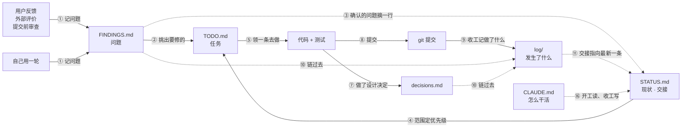
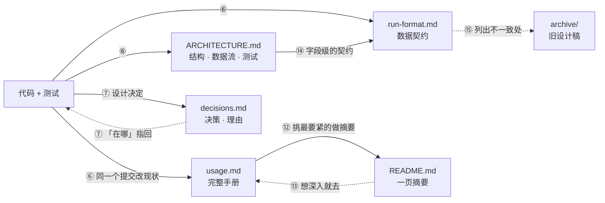

# 文档怎么用

规则只有三条：

1. **每类信息只放一处**，别处要用就链过去。
2. **只有日志（`log/`）记历史**，其余文档只写现状——改了就直接改，不留「原来是……后来改成……」。
3. **日志不复制内容**，只写发生了什么，并链到对应的文档。

## 文档分三类

| 类 | 文档 | 回答什么 |
|---|---|---|
| **给用户** | [`../README.md`](../README.md) | 这是什么、怎么上手、怎么读图（usage 的摘要） |
| | [`usage.md`](usage.md) | 每个功能怎么用、完整的命令参考、用户会碰到的限制（唯一来源） |
| **现状参考**（跟着代码改） | [`ARCHITECTURE.md`](ARCHITECTURE.md) | 代码怎么组织、数据怎么流、测试怎么跑 |
| | [`design/run-format.md`](design/run-format.md) | run 的每个文件和字段（接其他语言的契约） |
| | [`design/decisions.md`](design/decisions.md) | 还在生效的设计决策、理由、在哪 |
| **工作流程**（跟着干活改） | [`../CLAUDE.md`](../CLAUDE.md) | agent 怎么干活：开工读什么、收工写什么 |
| | [`STATUS.md`](STATUS.md) | 定位、范围、能用的、已知问题（开发视角）、交接 |
| | [`TODO.md`](TODO.md) | 接下来做什么、谁在做、做到什么算完 |
| | [`FINDINGS.md`](FINDINGS.md) | 自己用下来哪里不好，原样记下 |
| | [`log/`](log/) | 某段时间里发生了什么（唯一记历史的地方） |
| 不再维护 | [`archive/`](archive/) | 过去的设计稿 |

## 它们之间怎么合作

分两张图看，箭头编号和下面的表对应。实线是「内容从这里流到那里」，虚线是「只是链过去 / 指向」。

**图一：干活的循环**——问题怎么变成任务、做完怎么留下记录。



**图二：现状文档怎么跟着代码走**——谁是谁的来源、谁只是摘要。



## 每条箭头做什么

| # | 从 → 到 | 流过去的是什么 | 什么时候 |
|---|---|---|---|
| ① | 反馈 / 评价 / 审查 / 自己用一轮 → FINDINGS | 问题原样记下：日期、在做什么、哪里卡住、严重程度。烂就直说 | 发现问题时 |
| ② | FINDINGS → TODO | 决定要修的，写成任务：为什么做、做到什么算完（验收标准） | 排任务时 |
| ③ | FINDINGS ⇢ STATUS | 确认的问题在「已知问题」摘一行，链到在哪跟进；用户会碰到的限制不放这里，放 usage | 问题确认时 |
| ④ | STATUS → TODO | 定位、范围（核心 / 冻结 / 收缩）、当前里程碑决定 TODO 的优先级；落在冻结区的需求先问用户 | 排任务时 |
| ⑤ | TODO → 代码 | 一次领一条，移进「进行中」，写上谁在做 | 开工 |
| ⑥ | 代码 → ARCHITECTURE / run-format / usage | 功能、结构、数据格式变了，受影响的现状文档和代码放**同一个提交** | 每个提交 |
| ⑦ | 代码 ⇄ decisions | 做了（或推翻了）设计决定就写进去：决定、理由、放弃的方案、在哪；「在哪」指回代码 | 做决定时 |
| ⑧ | 代码 → git | 一条 TODO 一个提交，带测试 | 做完一条 |
| ⑨ | git → log | 收工在日志最上面追加一条：做了什么，带提交号 | 收工 |
| ⑩ | FINDINGS / decisions ⇢ log | 日志的「发现 / 决定 / 讨论」只写一句并链过去，不复制 | 收工 |
| ⑪ | log ⇢ STATUS | STATUS 的「交接」两三行：最近一次链到那条日志、下一步、没提交 / 没验证的 | 收工 |
| ⑫ | usage → README | README 只摘要 usage：上手、读图须知、重点功能、实测、最要紧的限制 | usage 的这些部分变了时 |
| ⑬ | README ⇢ usage / STATUS | 给想深入的人的出口 | — |
| ⑭ | ARCHITECTURE → run-format | ARCHITECTURE 讲哪些与语言无关，字段级的契约在 run-format | 数据格式变了时 |
| ⑮ | run-format ⇢ archive | 旧设计稿不再改，和代码不一致的地方在 run-format 开头列出 | — |
| ⑯ | CLAUDE ⇢ STATUS / TODO / log | 流程规矩：开工读 STATUS、TODO、日志最新一条；收工写日志、改交接、改 TODO | 每次开工 / 收工 |

## 容易放错地方的几类信息

| 信息 | 唯一的家 | 别处怎么用 |
|---|---|---|
| 用户会碰到的限制 | usage「已知限制」 | README 挑几条；STATUS 不重复 |
| 开发要还的债、现在坏的 | STATUS「已知问题」 | 每条链到 TODO / FINDINGS |
| 实测数字 | usage「实测数字」 | README 摘要 |
| 测试怎么跑、覆盖什么 | ARCHITECTURE「测试」 | CLAUDE.md 说提交前全跑；usage 指过去 |
| 踩过的坑、负面结论 | decisions | usage 指过去 |
| 为什么当时这么做（时间线） | log | decisions 只写现在还成立的理由 |
| 做完的任务 | log（当天那条） | TODO 里删掉 |

## 日志怎么写

`log/<年>-<月>.md`，一个月一个文件，新的在上面。每天（或每次收工）一节，没有的小节省略：

```markdown
## 2026-09-30

**做了什么**
- 一句话一件事，带提交号（`f02d662`）。

**发现**
- 问题一句话，链到 FINDINGS。

**决定**
- 决定一句话，链到 decisions / STATUS。

**讨论**
- 用户提了什么、怎么定的；关键的原话可以引。

**没做完 / 下一步**
- 一两条。
```

只追加，不改旧的；旧条目写错了就在新条目里更正。当天的那一节可以接着往里加。
