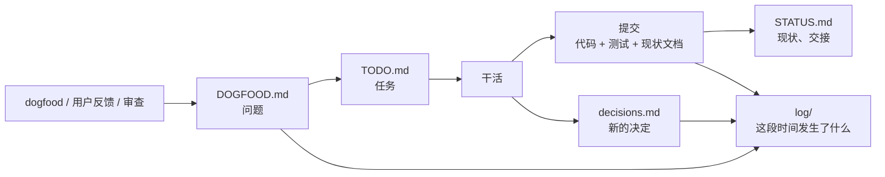

# 文档怎么用

每类信息只放一处。只有**日志**记历史，其余文档只写现状（改了就直接改，不留「原来是……后来改成……」）；
日志不复制别的文档的内容，只写发生了什么并链过去。

## 每份文档回答什么

| 文档 | 回答什么 | 什么时候改 | 谁读 |
|---|---|---|---|
| [`../README.md`](../README.md) | 这是什么、怎么上手、怎么读图 | 定位或上手方式变了 | 新用户 |
| [`usage.md`](usage.md) | 每个功能怎么用、完整的命令参考 | 功能、参数变了（和代码同一个提交） | 用户 |
| [`STATUS.md`](STATUS.md) | 定位、范围、能用的、已知问题、交接（下一步） | 每次收工 | 每次开工第一个读 |
| [`TODO.md`](TODO.md) | 接下来做什么、谁在做、做到什么算完 | 领任务、做完、发现新任务时 | 开工时 |
| [`DOGFOOD.md`](DOGFOOD.md) | 自己用下来哪里不好（如实写） | 每次 dogfood；修完的删掉 | 排 TODO 时 |
| [`log/`](log/) | **某段时间里发生了什么**：做了什么、发现了什么、定了什么、讨论了什么 | 每次收工追加一条 | 想知道「当时为什么 / 最近在干嘛」时 |
| [`ARCHITECTURE.md`](ARCHITECTURE.md) | 代码怎么组织、数据怎么流 | 模块增删、依赖方向变了 | 改代码之前 |
| [`design/run-format.md`](design/run-format.md) | run 的每个文件和字段（接其他语言的契约） | 数据格式变了 | 写录制端 / 读 run 的代码时 |
| [`design/decisions.md`](design/decisions.md) | 还在生效的设计决策和理由 | 做了新决定、推翻旧决定 | 想改一个设计之前 |
| [`../CLAUDE.md`](../CLAUDE.md) | agent 怎么干活 | 工作方式变了 | 每个 agent |
| [`../notes/`](../notes/) | 每个模块的讲解（产品的解读层用在自己身上） | 里程碑时刷新 | 深入某个模块时 |
| [`archive/`](archive/) | 过去的设计稿 | 不再改 | 考古 |

## 信息怎么流



- **发现问题**先进 DOGFOOD，决定要做了才进 TODO（带验收标准）。
- **做完一条**：代码、测试和受影响的现状文档（usage / ARCHITECTURE / run-format）在同一个提交里；TODO 删掉这一条。
- **收工**：日志追加一条（做了什么、带提交号；发现、决定、讨论、没做完的），STATUS 的「交接」改成两三行：下一步是什么，细节见哪条日志。
- **做了设计决定**：写进 decisions.md（现状），日志里记一句并链过去（时间线）。

## 日志怎么写

`log/<年>-<月>.md`，一个月一个文件，新的在上面。每天（或每次收工）一节：

```markdown
## 2026-09-30

**做了什么**
- 一句话一件事，带提交号（`f02d662`）。

**发现**
- 问题一句话，链到 DOGFOOD。

**决定**
- 决定一句话，链到 decisions / STATUS。

**讨论**
- 用户提了什么、怎么定的；关键的原话可以引。

**没做完 / 下一步**
- 一两条。
```

只追加，不改旧的；旧条目写错了就在新条目里更正。没有的小节省略。
