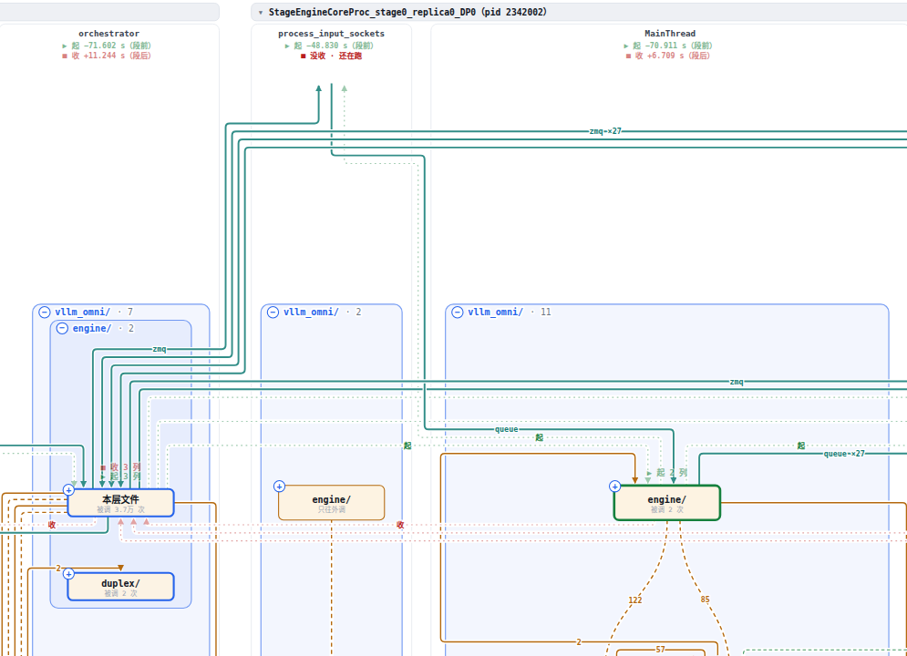
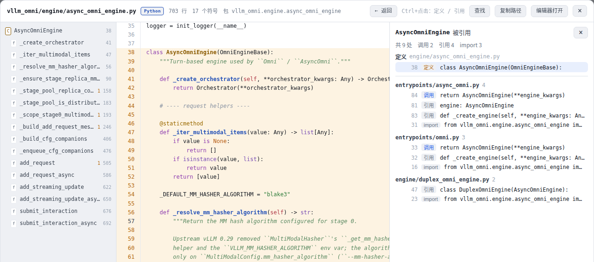

# codestrata 使用手册

README 讲 codestrata 是什么、怎么几分钟内跑起来；这份手册讲其余的一切：每个功能怎么用、界面上在哪、背后的规则、完整的命令参考、已知限制和实测数字。

命令里写 `<repo>` 的是被分析的仓库目录；写 `[repo]` 的可以省略，默认是当前目录。

## 目录

- **上手**：[安装](#安装) · [第一次用](#第一次用)
- **用功能**：[扫描](#扫描) · [看图](#看图) · [边的种类](#边的种类) · [录一次运行](#录一次运行) · [分阶段](#分阶段) · [管理 run](#管理-run) · [时间轴和时间顺序](#时间轴和时间顺序) · [读代码](#读代码) · [主菜单 codestrata app](#主菜单-codestrata-app)
- **参考**：[命令参考](#命令参考) · [输出文件](#输出文件) · [常见问题](#常见问题) · [实测数字](#实测数字) · [已知限制](#已知限制)
- **给开发者**：[前端和 API](#前端和-api) · [给开发者](#给开发者)（测试、设计决策、状态各在哪）

---

## 安装

### 要求

- **Python ≥ 3.10**（`pyproject.toml` 的 `requires-python`）。在 3.10 和 3.13 上装过、扫过、录过。
- **没有必需的第三方依赖**，只用标准库。可选的 `[highlight]` 装上 Pygments ≥ 2.17，用来给源码上色；不装的话，本地网页里的代码是纯文本。
  可选的 `[native]` 装上 tree-sitter 和它的 CUDA 语法（也认普通 C / C++），C / C++ / CUDA 文件才进图（见[扫描](#扫描)）；不装的话它们只能浏览。
- **时序事件（`trace` 默认录）要求被录的那个 Python 是 3.12+**（它要用 `sys.monitoring`），和 codestrata 自己装在哪个 Python 里无关：codestrata 装在 3.10 的 venv 里、去录一个 3.13 的程序，照样录得到事件。被录的 Python 低于 3.12 时，run 照样录完，只是没有事件（会打印一句说明），请求路径、时间顺序看不了。
- **操作系统**：录制（`trace`）只支持 Linux，别的系统上会直接说明并退出——它靠 `/proc` 认进程、找出 setsid 出去的服务，靠进程组和 SIGKILL 停干净。scan / serve / runs 在其他系统上也能 import、能用（测试里模拟过没有 `fcntl`、没有 SIGKILL 的环境），但只在 Linux 上实际跑过。
- **编辑器跳转**要 PATH 上有 `code`、`cursor`、`codium`、`code-insiders` 或 `subl` 之一（按这个顺序找）；都没有时 serve 会打印「没找到」，跳转按钮返回 501。

### 从 GitHub 装

```bash
python3 -m venv .venv && source .venv/bin/activate
pip install 'git+https://github.com/noviorlu/codestrata'                 # 不带高亮
pip install 'codestrata[highlight] @ git+https://github.com/noviorlu/codestrata'   # 带高亮
```

**别 `pip install codestrata`**：PyPI 上同名的包（0.2.1，「CodeStrata Engine」，来自 github.com/CodeStrata/codestrata-engine）是别人的，不是这个工具。

codestrata 可以装在自己单独的环境里，不用和被分析的仓库装在一起：`trace` 是把 hook 注入到你命令里的那个 `python` 上的。

### 从源码装（想改 codestrata 时）

```bash
git clone https://github.com/noviorlu/codestrata && cd codestrata
python3 -m venv .venv && .venv/bin/pip install -e '.[highlight]'
```

Ubuntu / Debian 的系统 Python 可能缺 venv 模块（报 `ensurepip is not available… apt install python3.12-venv`）。装上那个 apt 包，或者改用 uv：

```bash
uv venv .venv && uv pip install --python .venv/bin/python -e '.[highlight]'
```

---

## 第一次用

四步，顺序有讲究：

```bash
cd <repo>
codestrata scan                                      # 1. 静态扫描，写出 .codestrata/index.json 等
codestrata serve                                     # 2. 浏览器打开 http://127.0.0.1:8900/ 看静态图
codestrata trace --case demo -- python your_script.py   # 3. 录一次真实运行，存成一个新的 run
codestrata serve --hot demo                          # 4. 同一张图上叠这次跑到的调用
```

- **先 scan 再 serve。** 没 scan 过就 serve，会提示 `没有 …/.codestrata/index.json；先跑 codestrata scan …`。trace 可以在 scan 之前跑，只会打印一句提示；但叠图要用 scan 的结果。
- **serve 开着也能录。** 新录的 run 不用重启 serve，页面上方「运行」菜单里就有，还会亮一个小点提示。所以「serve 一次，然后反复 trace、在菜单里挑」也行。
- **时间轴、「时间顺序」、请求路径**要时序事件：被录的 Python 是 3.12+ 时第 3 步默认就录了，见[时间轴和时间顺序](#时间轴和时间顺序)。
- **`--hot` 只决定页面打开时先叠哪个 run**，页面上随时能换。它接受 case 名（取这个 case 最新一次录完的）或完整的 run id，写法见[管理 run](#管理-run)。

### 输出里的几个说法

- scan 最后打印每个节点的「架构高度」：+1 是入口（只依赖别人），−1 是叶子（只被别人依赖）。
- scan 的 `按规模自动拆开：*（占 66%，拆成 18 块）` 里，`*` 指扫描的根包本身。
- trace 的 `（21 次 import 时的模块顶层执行，41 次类体执行…：是定义、不算调用）`：import 一个模块时执行它顶层的代码、执行 `class` 语句定义类，这些都不算函数调用，不会让边变橙色。
- trace 和 serve 说的「N 个包」和图上橙色节点的个数可能不一样：图上按当前切面汇总，收起的目录（比如 flask 的 `json/`）里的几个模块算一个节点。
- 所有终端输出都是中文。

---

## 扫描

`codestrata scan [repo]` 用 `ast` 逐个解析 `.py` 文件（装了 `[native]` 时，扫描目录里的 C / C++ / CUDA 文件用 tree-sitter 解析，见下面「C / C++ / CUDA」），写出 `.codestrata/index.json`（模块、import 边、切面）、`symbols.json`（类和函数的位置）、`xref.json`（交叉引用，Ctrl+点击用）和 `graph.json`（函数之间的调用，格式见 [run-format §9.3](design/run-format.md#93-扫描端要产出的静态索引)），并打印扫了哪些目录。

### 扫哪些目录

- **不给 `--roots` 时沿用上次扫描的目录**（重扫不会悄悄换掉选过的目录），第一次扫才自动探测；`--roots` 后面不带目录是重新自动探测，比上次少扫了的目录会提示。
- **自动探测**按顺序试：仓库根目录下带 `__init__.py` 的库包（跳过 tests、examples、docs、scripts、benchmarks、tools、ci 这类）→ 没有的话取 `src/` 下的包 → 再没有就收只有测试之类的包 → 最后退到含 `.py` 最多的那个顶层目录。所以没有 `__init__.py` 的目录（比如很多研究代码的 `utils/`）和根目录直接放着的脚本通常不会被挑中。
- **给了 `--roots` 就照单全收**。仓库根目录直接放着的脚本（`train.py` 这类入口）用 `--roots .` 选，只取这一层，图上装在以仓库名命名的节点里。比如 gaussian-splatting：自动探测只扫到 34 个 `.py` 里的 12 个，`--roots . arguments gaussian_renderer lpipsPyTorch scene utils` 扫到 26 个。
- 最后一段同名的、或者一个在另一个里面的目录不能一起扫：模块名会撞。
- **src 布局**（`src/mypkg/...`）的模块名相对 `src/` 算，和代码里的 `import mypkg.x` 对得上。
- `trace` 默认用上次 scan 选的目录；没 scan 过才自动探测。

### C / C++ / CUDA

装了 `[native]` 时，扫描目录里的 `.c` / `.cc` / `.cpp` / `.cxx` / `.h` / `.hh` / `.hpp` / `.hxx` / `.inl` / `.cu` / `.cuh` 每个文件也是一个节点（按路径显示，比如 `gemm.cuh`）：

- **符号**：函数、方法、类 / 结构体，CUDA 的 `__global__` 记成 kernel（大纲里标 K）；限定名用 `::`（`qmk::decode_kernel`）。同一个文件里同名的几个定义（重载）算一个。
- **边**：函数调用和 `kernel<<<…>>>(…)` 启动都是代码里的调用（启动在边详情里标「启动 kernel」）；`#include "…"` 只用来排版，和 Python 的 import 一样。
- **近似**：名字是按文本对的，没有编译器的名字解析——被调的名字取最后一段，在仓库的原生函数里找同名的；写了 `a::b` 就要求限定名以它结尾；还剩好几个时依次只留同一个文件的、本文件 `#include` 得到的文件里的；仍然不止一个就不连（宁可不连，也不连错）。边详情里这些调用标「近似」。宏展开出来的定义和调用、模板实例化、虚函数、函数指针都认不了。
- Python 调进原生代码（ctypes、pybind11、`torch.ops`）在静态图上还没有边。

### 切面参数

- `--depth auto|N`：默认切面怎么定。`auto`（默认）按规模自动拆，规则见[看图](#看图)；`N` 表示展开所有深度小于 N 的目录（2 就是老的「二级包」）。
- `--expand DIR`：在默认切面上额外展开某个目录，可重复。目录写路径（`vllm_omni/diffusion`）或点分名（`vllm_omni.diffusion`）都行。

### 什么时候要重新 scan

- 改了代码之后。scan 之后改过的文件，Ctrl+点击的行列号就对不上了：那个文件不给 Ctrl+点击，重新 scan 即可。
- **重新 scan 之后要重启 serve**，图和搜索才会更新（Ctrl+点击会自动换新；从主菜单扫描的，主菜单会替你重启）。
- **升级 codestrata 之后**：索引的格式变了的话，serve 会提示「旧版本的格式，重新 scan」，主菜单的项目卡片上也会标出来。run 不受影响，重新 scan 之后照样叠。
- `serve` 也接受 `--roots`，但目前**不起作用**，扫哪些目录只由 scan 决定。

### 自动挂上的作者文档

包内的 README、frontmatter 用 `primary_code_paths` 声明了代码路径的设计文档、开头用反引号写出仓库路径的文档，会自动挂到对应的包上，出现在详情面板和给 agent 的输入包里——「为什么这样切」往往作者已经写过。

---

## 看图

### 分层

纵轴是依赖的层次：import 别人的在上，被 import 的在下，箭头尽量都从上指向下；只有循环依赖里被打断的少数边往上指。最上一层标「入口」，最下一层标「叶子」。每一层是图上的一条横带，叫**泳道**，最多 16 条（层太多时按比例压）。

叠了一个 run 之后，分层按**这次实际的调用**重排（调用方在上），运行时的边权重是静态边的 10 倍。所以回调、按注册表分派这类和 import 方向相反的调用照样往下走，「这个 case 走了哪条路」从上往下读就是。代价是换 run 时节点会上下挪。叠了 run 的图在页面上叫 **hot 图**（参数 `--hot` 由此得名），不叠 run 的是静态图；「视图 → 只看跑到的」给出单独排版的 hot 图。

### 按进程 · 线程分列（叠了录了时序事件的 run 就是它）

多进程、多线程的程序（vLLM 这类）一次请求要在几个进程、十几条线程之间交接，合在一张图上看不出谁在什么时候干什么。叠了录了时序事件的 run，图按**进程 · 线程**分成并排的几列：



- **一列是一类线程**，按进程分组（进程头写进程标题和 pid，▾ 把整个进程收成一条）。名字归一之后同名的合成一列：`Thread-3 (save_loop)` 写成 save_loop，线程池的 `ThreadPoolExecutor-3_0…_3` 合成 `ThreadPoolExecutor-3 ×4`，每步新开的 249 个 `omni-async-output-builder` 合成一列 ×249（悬停列头看合进来的原名）。
- **列里**只放这条线程调到的节点（当前切面上的文件 / 目录），边是这条线程里的调用，标次数；全是代码里看不出的画虚线。
- **同一个节点在几列里各有一份，放在同一高度**（纵坐标沿用「只看跑到的」那张图的分层），横着一看就是同一个；鼠标停在一份上（或点它）时，它在别的列里的副本高亮、用蓝色虚线连上——这多半就是几条线程共用的对象、队列、共享内存通道所在的地方。
- **列之间的连线**：粗的是**谁把数据交给谁**，标通道和次数——进程内的 `queue.Queue` / `asyncio.Queue` / janus 队列按「同一个队列里的同一个对象」配对，跨进程的 ZMQ 按消息内容的指纹配对；绿色细虚线是**谁起了谁**（在哪一行 `Thread.start`、起子进程），红色细虚线是**谁回收了谁**（从被回收的那一列连到 `join` / `waitpid` 等到它结束的那一行；线程池的 `shutdown(wait=True)`、`Popen.wait`、`Process.join` 都算）。只跑仓库外代码、但是交接一头的线程（vLLM 收发 ZMQ 的输出线程）给一列空的，标「仓库外的代码」，交接链才不断。
- **起 / 收**：像阶段的起点 / 终点那样，起线程的节点描绿、上面写「▶ 起 worker」，回收线程的节点描红、写「■ 收 worker」（一个节点起了好几列写「▶ 起 8 列」，点它：这几条连线都高亮，详情里逐条列出起 / 收的那一行，点名字看那一条）。列头写这一列的线程什么时候起（`▶ 起 ×2 +0.248 s`）、什么时候收（`■ 收 ×2 +0.278 s`）；没人 join 的写「■ 没收 · 跑完了」或「■ 没收 · 还在跑」（悬停看是不是守护线程），子进程没看到 waitpid 的写「■ 没看到谁收」。时刻从这一段的开头算，这一段之前的是负的（`−1.500 s`）。
- **GPU kernel**（`trace --gpu` 的 run）：kernel 按 **GPU 设备 · 流**各成一列（「GPU 0 · 流 7」），放在它的进程最后；列里是 kernel 定义所在的节点（仓库里的 `.cu`，或者「GPU · 仓库外」）。从发起它的那一列的调用方节点连过去一条橙色细虚线，标「GPU ×次数」；时刻按发起算。点「GPU · 仓库外」看这一段里每种 kernel 跑了几次、在 GPU 上一共跑了多久（按时间排）；放 `.cu` 的节点详情里也列它定义的 kernel。
- **选了阶段 / 拖了时间段**：列只放这一段里跑过的线程（有调用，或者它那一头的交接在这一段里），起 / 收、谁起了谁、谁回收了谁也只算这些线程；段外的时刻照写、每个时刻各自标「段前 / 段后」，整条都在段外的连线画淡（用户 2026-10-01 定的）。起它 / 收它的线程这一段里没跑的，列头照样写是谁，加「（这一段里没跑）」。交接按放 / 发的那一刻算进这一段；取的那头这一段里还没有调用的线程也给一列，只放交接的那个节点（写「只在这里交接」，起 / 收不算它）。这一段里一个调用都没有时，图上写明是空的、让你拖长一点或选一个阶段。
- **列的先后**：进程按启动先后（父进程在前）；一个进程里顺着交接走（vLLM 的 stage：收请求 → 主循环 → 输出线程），其余放后面。列按内容宽，小列窄，放不下就横向滚动。
- **切面每列各自的**（用户 2026-10-02 定的）：能展开的节点左上角有 ＋，点了只在这一列里换成它的子模块，别的线程、别的进程都不变，这一列里新出来的节点闪一下。展开着的目录像模块图那样画成**框**：框头写名字、这一列里框着几个，框头的 − 只收起这一列里的它。名字照模块图：框里的写相对于框的名字，本层文件写「本层文件」。一个节点放在哪一行只看它自己：展开出来的子模块排在原来那个节点那一层下面的几行里，所以别的列的层和先后不变，最多被推开几个像素；同一层子模块多于 5 个会折成几行（同模块图折行），不会排成一长条。详情里的「展开 / 收起」改选中的那一份所在的列；「恢复默认层级」把所有列都回到默认的切面；换阶段 / 时间段保留各列的展开，换 run 清掉。鼠标停在一份上，别的列里同一个节点、它在那一列里展开成的框、装着它的节点（那一列里它还收着）都算它的一份，高亮、连上。选中的东西接着选：选中的那一份被收进了上一级就选上一级（同一列），它自己被展开了就选中那个框（详情照旧讲它，换成「收起」）；点框头选中框，详情列出这一列里框着的节点。点了「▶ 起 N 列」/「■ 收 N 列」这种一次选中好几条连线的标签之后，改任意一列的切面都会把这个选中清掉（认不出该恢复哪几条）。
- **点节点**：只选中点的那一份（这条线程里的这个模块，别的列里的副本不算）；和模块图一样，这一列里碰到它的边、碰到这一份的连线高亮，另一头的节点照常，其余的（包括它在别的列里的副本）淡下去；点一条边 / 连线也一样，只留它和两头。鼠标停在节点上照样连上它在别的列里的副本。
- **节点详情只讲这一份**（用户 10-01 定的）：「调用 → / ← 被调用 / 代码里没写、这次跑了」只列这条线程里的，再列一头是它的连线（另一头是哪一列、种类、通道、次数、第一次的时刻）；点名字选中这一列里的那个节点，点次数看那条边 / 连线。文件树、源码不分线程。
- **搜索**：每一列按自己的切面描出装着命中项的那个节点（一列里它展开着就描子模块，另一列里收着就描装着它的目录）；回车选中调到它的第一列（列的先后）里的那一份，被收着的只在那一列里展开到它；搜到函数时详情里展开到它。这一段里哪条线程都没调到它就说一声。
- **点**节点、列里的边：和模块图一样开详情（边详情不分线程，详情里点一头的名字选中同一列里的那一份）；点**列之间的连线**（线上，或者它的标签「zmq ×27」「起 ×28」「收」）：图上两头的节点下面标出**那一行代码**（`起 · s_threads:52  t.start()`、`放 / 发 · put_job:83  q.put(job)`；被起 / 被回收的那一头是线程的入口函数），点标签在代码窗口里看那一行。详情里写是哪种、经什么通道、几次、第一次和最后一次在什么时候，两头各是哪个进程 · 线程的哪个节点，以及「两头的代码」：每一对函数两头各是哪一行、那一行写的是什么，点了在代码窗口里只标出那一行（放 / 取发生在仓库外的代码里时写那一刻这条线程最底下在跑的仓库函数，标「经仓库外的代码」；那一刻没有仓库函数在跑就写「仓库外的代码」，连到列头）。被起的一头写线程的入口函数：线程名写着 target 的（`Thread-N (x)`）就是 x，x 在仓库外写「仓库外的代码」——x 在仓库里时它从线程起来到结束一直在栈底，它在仓库外的代码里做的交接、waitpid 也记在它头上（x 在仓库外的，比如 `asyncio.run`，按那一刻还没返回的仓库函数认）；名字里没写的取这条线程最早跑的仓库函数，在它之前已经在仓库外的代码里收发过的（vLLM 收发 ZMQ 的线程）写「仓库外的代码」。从非主线程 fork 的子进程没有 MainThread（唯一的线程沿用父进程那条线程的名字），fork / waitpid 就接那一列。那一行是放 / 取、起线程那一刻最里层的仓库函数正执行到的那一行，经仓库外的代码转了一道的（`executor.submit`、`subprocess.run`）是调进去的那一行；录制之后文件改过的，跟着函数整个挪。点了详情栏自动展开；再点一次、点空白处或 Esc 取消选中。
- 「边」那一行的开关照样管用：**这次跑了**、**其中代码里看不出**管列里的边；**时间顺序**见下面「时间顺序」一节。分列里没有「代码里写了、没跑到」的边，也不要合成一张图（用户 2026-10-01 定的：运行时一律按线程分），所以「代码里的调用」和「只看跑到的」这两个开关藏起来。没录时序事件的 run 没有线程的信息，照旧画成一张图。
- **排线**：每条线有自己的接点和自己的轨道，不和别的线叠成一根，也不从节点后面穿过。
  - 两层节点之间的空隙里是一条条横的轨道：**往右的连线从节点顶边出来、走上面的轨道，往左的从底边出来、走下面的轨道、从底边进终点**——一来一回的两条（比如 main ⇄ orchestrator 的两条 janus）围成一个圈，正向在上、回来的在下；
  - 列里的边：往下一层的从底边 S 形落进下一层的顶边；隔着几层的，中间没有节点挡着就直着下去，挡着的沿列的左边或右边竖着走（是这一行最边上的节点时从它的侧面出来），都从顶边进被调方；同一层的、往上的也走轨道；
  - 轨道的先后按交叉最少来排（同 ELK 的正交排线），接点跟着轨道的先后排（往左拐的在左、往右拐的在右，近的在里），同样两头的几条套在一起、不交叉；
  - 空隙放不下就把下面的层整体往下推（各列一起推，同一个模块还是横着对齐），列旁边放不下就把列加宽；接在列头上的（没有节点的列、收起的进程）走第一层上面的轨道，不在同一层的连线在终点那一列旁边的缝里竖着走。
- **点线**：点哪条按**离鼠标最近的那条**算（12 像素以内），不是哪条叠在上面算哪条：鼠标附近最近的那条加粗、变手形，停一会儿出的提示就是它的，点下去选中的也是它；几条一样近（正好交叉的地方）时提示写「这里叠着几条」，点了弹一个小单子挑一条（Esc 或点别处关掉）。线底下垫了一圈底色，交叉的地方看得出谁压着谁。标签（`janus ×3`、次数）写在它那条线上、挑没有别的线经过的横段，点标签就是点那条线。「▶ 起 / ■ 收」在箭头上面；选中连线时两头标代码的标签放在节点的另一边（走下面的连线标在节点上面），不压着它自己。
- 盯的交接通道只有上面几种：`queue.SimpleQueue`、线程池的 `submit`、共享内存、裸管道和 socket 上的交接没有连线（stage1 → stage2 走的共享内存通道两边是同一个模块，悬停能连上）。

### 切面：大仓库怎么显示

scan 记的是最细的粒度：每个 `.py` 文件一个模块，依赖、符号、调用明细都在文件之间。图上显示的是目录树的一个**切面**：收起的目录是一个节点（名字带 `/`），展开的目录换成它的子目录和文件；一个目录里直接放着的文件超过 12 个，合成一个「本层」节点，也能再展开。

- **默认切面按规模自动算**：从根开始，反复把代码量超过全仓 10%、拆开后不超过 30 个子节点的最大节点拆开，直到拆不动或图上到了 80 个节点。宽而平的目录（几十个同类实现，比如 vllm-omni 的几十个模型族）留成一个节点。vllm-omni 的 `vllm_omni/` 包上，diffusion 拆成 19 块、model_executor 拆成 8 块，共 60 个节点；scan 会打印拆了哪些。
- **展开**：点节点左上角的 **＋**，就在当前图上把它换成子模块（重新汇总边和高度、重新排版，新出来的节点闪一下）。详情里也有「展开（N 个子模块）」。
- **展开的目录画成一个框**，框头的 **−** 把它收回一个节点；框可以嵌套。纵轴仍然是依赖的层次，所以框不能在纵向上把子模块挪到一起：每个展开的目录在横向上占一段自己的列，框从它最高的子模块画到最低的。只跨一两条泳道的小框不占满整列，别的泳道里那段宽度让给散放的节点；泳道跨度不重叠的框可以上下叠在同一列。框的左右顺序只取决于框本身，展开一个无关的目录不会让别的框换位置。
- **收起**：框头的 −，或详情里的「收起到 …」。工具栏的「恢复默认层级」回到 scan 算出的切面。
- **展开多了画布会变宽**：图框撑宽到窗口，字最多缩到 0.88 倍，再宽就在图框里横向滚动（按住空白处拖），边缘有渐隐提示那边还有东西。泳道放不下时折行，框永远装得下标签。
- **展开 / 收起不会取消选中**：选中的节点还在就还选着它；被收进了框就选中收回来的节点；自己被展开成框就选中那个框。
- 切面只是一组展开着的目录（`/api/graph?open=a,b`），不改任何数据。

### 点节点、点边

- **详情栏第一次是收着的**：点了节点或边之后，再点页面底部的「详情」栏（或它左边的 ▴）展开，之后记住开合状态。
- **点节点**：下面的详情抽屉里是它调用谁、被谁调用、文件树、类和函数、源码片段（带真实行号）。选中的节点用蓝色光晕标出，不改边本身的颜色——选中一个节点时，最想看的恰恰是它的边里哪些是真调用。再点一次、点空白处或按 Esc 取消选中。
- **点边**：这条边上哪个函数调了哪个、各几次，调用写在调用方的哪一行（录制时记下的），被调函数的定义。代码里看不出的标出来，说明 scan 在那一行看到了什么；被调的类在仓库里被按名字登记过的（注册表、插件表，比如 `registry.py:3` 的 `"toy.plugins.double:Double"`），一并列出那几行。折叠栏「代码里写了，这次没录到」（构造一个 trace 看不到的类，比如 dataclass，单独说明）。每种最多列 60 对，多的写明还有几对。规则见[边的种类](#边的种类)。

### 工具栏和缩放

- 「边」一行是开关兼图例，每种边后面带条数：代码里的调用（灰）/ 这次跑了（橙色，实线虚线都算）/ 其中代码里看不出（虚线；「这次跑了」关着时点不了），以及时间顺序。
- 「视图」：**只看跑到的**（没录时序事件的 run：只放这次跑到的节点，单独排版，得到一张单独的运行时图）。**叠了这种 run 默认就是它**，点一下回全图；自己关过之后换 run 不再替你打开。录了时序事件的 run 一律按线程分列（见上面一节），这个开关和「代码里的调用」藏起来。「请求路径」、「重置」。
- **点边**：点线上任意一处，或者点边上的次数、时间顺序的序号牌，打开的都是这条边。几条线挤在一起时，跑到的边在上面、先被点到。
- 「?」打开帮助；帮助里「这次跑了什么」列出这个 run 的命令。
- **读图须知**：叠着 run 时工具栏下面有一行（调用方是栈上最近的仓库内函数、次数高的多半是轮询、import 不算调用），× 关掉之后记在浏览器里，「?」的说明里一直有；那里还解释了「未归到命名符号的调用」（进 lambda、生成器表达式这类没有名字的代码的次数）。
- **缩放**：图的**左上角**有 ＋ / － / ✥ / 100% 四个按钮：放大、缩小、移动模式（按住任意位置拖动图，按在节点上也不会选中它）、回到适应宽度。Ctrl（Mac 上 ⌘）+ 滚轮以鼠标为中心缩放，不按 Ctrl 的滚轮照常滚页面；触控板双指捏合也行。图比框宽时按住空白处拖动。

---

## 边的种类

图上的边只有**调用**：函数 → 函数，按当前展开的目录合起来画。只 import 没用到的、只读对方的常量、只把类当参数传、只写在类型标注或 `isinstance` 里的都不是调用，不成边（import 关系只用来排版）。每条边记两样：**scan 看到的**（代码里写了这个调用、写在哪几行）和 **trace 看到的**（这次运行真的发生了、几次、调用写在哪一行）。

| 图上 | 含义 |
|---|---|
| 灰实线 | 代码里写了的调用（scan 定下了被调方），这次没录到；没叠运行时就是全部 |
| 橙实线 | 这次运行真的调用过，代码里也写了；粗细不变，边上标调用次数 |
| 橙虚线 | 这次跑了，但全都是代码里看不出会调到它的（只有 trace）：多态（`self.model` 按配置挑的类）、注册表 / 插件 / `getattr`、回调、框架转了一道 |

- **怎么算「代码里看得出」**：trace 记下 F 在第 L 行调了 G；看 scan 在 F 的第 L 行记的调用：定下的被调方就是 G，算两边都有。其余是只有 trace，边详情里写明 scan 在那一行看到了什么：写的是基类的方法 `Base.m`、跑的是子类覆盖的；只知道写的名字，正好是 G 的名字（`self.model.compute_logits`、`with` / `for` / `[]` 这类语法触发的特殊方法）；这一行别的调用（仓库里的函数、仓库外的 `sorted` / 线程池、定不下的名字、`super().x`），经其中一个转了一道（跨过这一行的多行外层调用、语法触发的特殊方法不算）；这一行读了属性、触发的是 property 或 `__getattr__`；这一行没看到调用（模块级 `__getattr__` 这类）。F 自己里面的 lambda、生成器表达式被调到算两边都有。
- **生成器、协程、`with` 晚一步才开始跑**：trace 记的是帧真正开始的那一行（`for x in g`、`await wait_for(…)`、`with (` 那一行），代码里写调用的是另一行。这一行没有写明的调用、或者被调方写在这一行那个调用的参数里，而 F 在函数里别处写了对 G 的调用，算两边都有，说明里写「写在第几行」。
- **构造 `C(…)`**：跑的是 C 沿继承找到的 `__new__` / `__init__` / `__post_init__`，这些调用算在 F → C 上（边详情里的被调方是类，写明跑的是哪个方法），和代码里写的那一处对上，一次构造只算一次。基类在别的文件里也不另起一条边。构造时跑的代码不在仓库里的（dataclass 生成的 `__init__`、只有仓库外基类的），trace 看不到，边详情里单独说明。
- **一部分代码里看不出的边画实线**，悬停和边详情里写明其中几次看不出；全都看不出才画虚线。
- **用 property（读、赋值、`del`）、装饰器 `@x` 都算调用**：它们真的执行了函数。
- **之前录的 run 没有调用行**（2026-09-30 之前）：在调用方整个函数里比，调用处按名字猜（边详情里写明「按名字找到的」）；调用方里连同名的调用都没有的，多半是经仓库外的代码（框架、引擎循环）调过来的，边详情里也这么写。代码窗口里不标运行时调到了谁（窗口头上写明）。录制之后改过的文件里，模块顶层的调用行挪不过来，也按整个函数比。
- **「代码里看不出」有假阳性**：scan 推不出接收者类型的（没标返回值类型的工厂造出来的对象，能推什么见下面「Ctrl + 点击」一节的「名字指向哪」）；用 property 时接收者的类型定不下的。标注写的是基类或 Protocol、跑的是子类或实现的，按「写的是基类的方法」算只有 trace。
- **import 触发的模块执行不算调用**：只被 import、一个函数都没被调过的包不算「跑到了」。

一个具体例子：一个玩具仓库里，`engine.py` 通过 `registry.load("double")` 用 importlib 按字符串加载插件。代码里 engine 和 `plugins.double` 之间没有调用；录一次之后出现一条橙虚线，边上标着 20；点开它，看到 `Engine.step → Double.run`，调用写在 `step` 的哪一行、scan 在那一行只知道名字 `run`，按名字登记的地方指到 `toy/registry.py:3` 的 `_REG = {"double": "toy.plugins.double:Double"}`。

---

## 录一次运行

### 基本用法

```bash
codestrata trace [repo] --case NAME [选项…] -- 你平时跑它的命令
```

- **`--` 不能省。** 它后面的一切都是要跑的命令（脚本、pytest、起服务的 sh 都行）。
- **命令默认在仓库根目录执行**，相对路径按仓库根目录算；要在别的目录执行就加 `--cwd DIR`（`--cwd .` 是当前目录）。命令里的相对路径在仓库根目录下没有、在当前目录下有时，trace 开录之前就会停下来说明并建议 `--cwd .`，不会留下一个失败的 run。
- **命令用的是 PATH 上的那个 `python`**，被分析的仓库和它的依赖得在那里 import 得到（通常是 `pip install -e .`）。
- `--case` 只能用字母、数字和 `._-`。同名 case 重录不覆盖，每次都是一个新的 **run**。
- `--timeout S`：超过这么多秒就按三级顺序停掉命令。
- `--env K=V`（可重复）：给命令加环境变量，会记进 run、复刻命令里也有。
- `--attach FILE`：把这个文件一起存进 run，比如被 case 脚本 `source` 的 `common.sh`。
- `--tag T`、`--note TEXT`：给 run 打标签（比如 `model=Qwen2.5-Omni-7B`）、写一句备注。
- `--roots DIR…`：仓库代码在哪些目录（把安装包映射回仓库时用）；默认用 scan 时选的。
- `--no-events`：不记时序事件（默认记，被录的 Python 要 3.12+），见[时间轴和时间顺序](#时间轴和时间顺序)。
- `--phase NAME=FUNC`：切阶段，见[分阶段](#分阶段)。
- `--gpu`：同时录 GPU kernel，见下面「GPU kernel」。

```bash
codestrata trace <repo> --case qwen-chat --env MODEL_NAME=Qwen2.5-Omni-7B --tag model=qwen \
    --attach ../common.sh -- bash case.sh
```

录完会打印进程数、被调到的函数数、文件间调用边数、退出码、用时，以及映射到了多少个包和符号、调用最多的包，最后给出叠图的命令。`--gpu` 时多一行：录到几次 kernel、几种、GPU 上一共跑了多久。

### GPU kernel（`--gpu`）

`--gpu` 让每个用 CUDA 的进程同时录下 GPU 上跑的每个 kernel：起止时刻、设备、流，和发起它的那次启动调用（`cudaLaunchKernel`、`cuLaunchKernel` 这类，在哪个线程、什么时候）。

- **要什么**：本机有带 CUPTI 的 CUDA 工具链（`cupti.h`、`libcupti.so`；按 `--env CUDA_HOME=…`、环境里的 `CUDA_HOME` / `CUDA_PATH`、PATH 上 `nvcc` 所在的、`/usr/local/cuda*` 的顺序找）和 `g++`：录制端是一小段 C++，第一次用时现编、按源码哈希缓存在 `~/.cache/codestrata/cupti/`。要时序事件（不能和 `--no-events` 一起用）。
- **怎么注入**：CUDA 运行时按环境变量 `CUDA_INJECTION64_PATH` 把录制端载进进程，不用改被录的程序，PyTorch 的、自己 `<<<…>>>` 启动的、ctypes 调进去的 kernel 都录得到。
- **挂到谁身上**：一个 kernel 的调用方是发起它那一刻、那个线程真实的调用栈上最里层的、被录到的函数（比如 `Lib.launch` 启动了 `decode_kernel`）——整理时重放时序事件，在启动调用的那一刻看栈，挂起着的生成器 / 协程不算。被录到的是仓库目录下的代码，放在仓库里的 `.venv` 也在内，所以调用方可能是三方库的函数（比如 triton 的）。不经 C++ 的静态调用链去补中间几跳，也不知道是这个函数里的哪一行。这种边是只有 trace 的（橙色虚线），边详情里标「GPU kernel」。
- **仓库里的 kernel 和仓库外的**：名字（去掉返回类型、模板参数、参数表）对得上扫描到的 `__global__` 的，落在定义它的文件上，和别的函数一样；对不上的（PyTorch、cuBLAS、Triton 生成的……）都落到一个虚拟节点「GPU · 仓库外」上，它只在叠着的 run 跑到了才画，放在图最下面一层。
- **次数和 GPU 时间总是全的**：直接从 GPU 日志算，时序事件到了行数上限、整理失败都不影响。找不到发起它的调用的（启动它的线程上当时没有被录到的函数在跑、在时序事件截断之后发起的）照样算次数和 GPU 时间，只是没有调用边；`trace` 结束时和 `runs show` 会说有几次。
- **不录的**：fork 出来的子进程里的 kernel；kernel 内部（一个 kernel 里跑了哪些 device 函数）。

### 录真实部署：服务、多进程、安装包

运行时图的 case 往往是「起一个服务、发一次请求」，被录的是 pip 装好的包、拆成好几个进程。codestrata 为此处理了这几件事：

- **子进程一起录。** hook 通过 `PYTHONPATH` 上的 `sitecustomize.py` 注入，fork、spawn、exec 出来的每个 Python 进程都会挂上。
- **跑的是安装包也能叠图。** 执行路径落在 `site-packages/<顶层包>/` 下时映射回仓库文件，并逐文件比对内容；不一致会警告行号不可信。
- **子进程数据不丢。** 拦截 `os._exit`（multiprocessing 的 fork 子进程这样退出）和 `os.exec*`（换程序之前先落盘）、每 10 秒落盘（被 SIGKILL 最多丢 10 秒）、fork 后清零计数（不重复计入父进程）。落盘全部串行，写坏的分片会记成问题，不会悄悄丢掉一个进程。hook 不装信号处理器——那会改变被录的程序的行为；要升级到 SIGTERM 之前，codestrata 写一个 `STOP` 文件，各进程的落盘线程看到就先落一次。
- **停要停干净。** 命令放在自己的会话里；超时、Ctrl+C、终端关掉时按 SIGINT → SIGTERM → SIGKILL 三级停整个进程组（`--stop-grace` 秒后才升级，默认 90；再按一次 Ctrl+C 或按 Ctrl+\ 直接升级）。命令退出后再找出还属于这次录制的残留进程（比如 setsid 出去、case 脚本没停掉的服务），同样停掉并记进 run：靠 `/proc/<pid>/environ` 里的 `CODESTRATA_OUT`，加上分片里记的（pid, 启动时刻）——vLLM 用 setproctitle 改进程标题，会清空 environ。忽略 SIGINT 的进程（看 `/proc/<pid>/status` 的 SigIgn）直接发 SIGTERM。
- **哈希取执行时的。** 每个进程第一次跑到一个文件时就记下它的内容哈希；录制中途改了文件，run 会标出来，之后叠图时这个文件也算「改过」。

### 读运行时图要知道的

- **「调用方」是最近的一个仓库内的帧。** 穿过仓库外代码（框架的事件循环、库里的回调）的调用会显示成直接调用。
- **调用次数高的多半是轮询**，不等于重要。
- **case 自己的代码例外**：入口脚本那一层目录里的 `.py` 在栈上当调用方。case 里定义、被仓库回调的函数（Flask 的视图）再调仓库函数时，调用方记成 `<外部代码>/脚本名`，和 scan 不扫的 examples/ 一样不上图，不会画成 `dispatch_request → jsonify` 这种并不存在、代码里也看不出的边。
- 栈深超过 2000 时砍半，极深递归下调用方可能不准。

---

## 分阶段

一次运行往往是「加载 → 处理请求 → 退出」。切成**阶段**之后可以只看其中一段，启动时的初始化不会混进来。两种办法，可以一起用：

1. **按函数切**：`--phase 名字=函数`。哪个进程第一次进入这个函数，就在那一刻切到这个阶段；别的进程 50 ms 内跟上，触发的线程停 0.1 s 等它们。不用改被录的脚本，「一条阻塞的 python 命令」也能分出加载 / 推理 / 关闭。函数写成 `模块:qualname`（查静态索引，继承来的方法也认，`Omni.close` 会认成 `OmniBase.close`），或 `文件路径:qualname`（不在索引里的文件也行，比如 examples/ 下的入口）。
2. **在 case 脚本里写**：往 `$CODESTRATA_OUT/PHASE` 写一个阶段名。适合服务类的 case：健康检查通过后写 `serving`。

第一次切之前的那段叫 `start`。用 `--phase` 切时，每个阶段整个 run 只切一次：同一个函数不能反复切，也切不回早先的阶段；case 脚本写 PHASE 可以切回早先的阶段（时间条上这个阶段就有几段）。

```bash
# 离线脚本：不改脚本，按函数切
codestrata trace <repo> --case offline \
    --phase generate=vllm_omni.entrypoints.omni:Omni.generate \
    --phase shutdown=vllm_omni.entrypoints.omni:Omni.close -- bash run_single_prompt.sh

# 服务：case 脚本里（服务就绪后）写 PHASE
[[ -n "${CODESTRATA_OUT:-}" ]] && { echo serving > "$CODESTRATA_OUT/PHASE"; sleep 2; }
codestrata trace <repo> --case demo -- bash case.sh
codestrata serve <repo> --hot demo@serving       # 再勾「只看跑到的」，得到单独排版的运行时图
```

页面上「时间」一行列出各阶段的按钮；图上用绿色 ▶ 和红色 ■ 标出阶段的起点和终点（`--phase` 的触发函数所在的节点）。

---

## 管理 run

静态分析只有一份，随时 `scan` 重建；运行记录不能重建——一次录制往往是几分钟 GPU。所以每次 `trace` 都存成一个新的 **run**（`.codestrata/runs/<时刻>-<case>/`），同名 case 重录也不覆盖：今天录 MiniCPM、明天录 Qwen，两份都留着，随时叠到图上。数据格式见 [design/run-format.md](design/run-format.md)，设计决策见 [design/decisions.md](design/decisions.md)。

### run 里有什么

- **原始数据，永久保留**：各进程的分片（`parts.tar.gz`）、case 脚本和命令里提到的配置文件（`files/`）、`run.json` 和 `detail.json`（git、Python 和包的版本、GPU、原样命令、环境变量）、时序事件的原始日志（`events/raw.tar.gz`）。
- **派生数据，可以用 `runs merge` 从原始数据重算**：计数（`counts.json.gz`）、整理好的时序（`events/spans/`）。

### 代码改了，老 run 照样能用

计数按 `文件:首行号` 存，打开时才映射到当前的索引上：哪些文件在录制之后改过会逐个标出来（页面顶部的横幅），而不是整个 run 作废；改过的文件里，按录制时记下的函数名（qualname）把次数挪到函数现在的行号上，函数整个挪下去几行、文件开头加了注释都对得上；函数里的调用行跟着函数挪（函数体里面改过的就可能偏）。模块顶层、lambda、生成器表达式没有可以对的函数名：它们的调用行挪不过来，按调用方整个函数和代码比。（被录的 Python 是 3.10 时没有 `co_qualname`，改过的文件里的次数挪不回去。）

### 怎么指定一个 run（RUN 的写法）

- 完整的 run id，比如 `20260929-221354-hello`；
- 或 case 名：取它最新一次完整录完的；没有的话取最新一次录了一部分的，并打印提示；
- 后面可以加 `@阶段`（`demo@serving`），或 `@t=起-止`（单位微秒，要求这个 run 录了事件）。

`serve --hot`、`runs show` 都认这个写法。页面上选的 run 记在地址里（`#run=<id>@<阶段>`），刷新、复制地址再打开都还是它。

### runs 命令

```bash
codestrata runs <repo> ls [--case C]          # 按 case 分组：状态、时长、进程数、git、录制后改过几个文件、大小、有没有时序、标签、备注
codestrata runs <repo> show RUN               # 详情：阶段、进程、Python 和包的版本、GPU、存下的文件、文件相对当前代码的状态、复刻命令、继承的环境变量
codestrata runs <repo> tag RUN T…             # 加标签；untag 去标签
codestrata runs <repo> note RUN TEXT          # 写备注（覆盖原来的）
codestrata runs <repo> rm RUN_ID… [--yes]     # 删 run：只认完整的 run id；还在录的删不了；不在终端里运行时必须加 --yes
codestrata runs <repo> rm RUN_ID --events-only  # 只删时序事件
codestrata runs <repo> merge RUN              # 从原始数据重算计数和时序；录制中断时用它把散着的分片合起来
```

### 存储

- `runs/` 可以是软链（比如指到大盘）。**`.codestrata/` 里除了 `runs/` 都能随时删掉重建**；`runs/` 删了就没了。
- 老版本的 `trace-<case>.json` 第一次被读到时自动迁成 run（原文件逐字节留在 run 的 `legacy/` 里）。

### 复刻

每个 run 存下录制时原样的 codestrata 命令和所在目录（`cd <目录> && codestrata trace …`，照抄就能再录一次），以及 shell 里和跑模型、找解释器有关的环境变量——命令会继承它们，光看命令复刻不出来：

- 前缀是 `CUDA_`、`VLLM_`、`PYTORCH_`、`TORCH_`、`NCCL_`、`HF_`、`TRANSFORMERS_`、`TOKENIZERS_`、`OMP_`、`MKL_`、`NVIDIA_`、`TRITON_`、`XLA_` 的；
- 以及 `PATH`、`PYTHONPATH`、`LD_LIBRARY_PATH`、`VIRTUAL_ENV`、`CONDA_PREFIX`、`CONDA_DEFAULT_ENV`、`PYTHONHASHSEED`。

名字像密钥的（`HF_TOKEN`、`VLLM_API_KEY` 这类）一律不记；值里 URL 带的账号密码、命令里 `--api-key X` 这类选项的值，在网页上显示时隐去。

在哪复制：网页上 run 按钮旁边的「复刻」、「?」帮助里「这次跑了什么 → 复制」，或者 `runs show`。老 run 没存原始命令的，按 run 里存的参数拼一条并注明。复刻不是万能的：只记白名单里的环境变量，换一台机器照抄不一定能跑。

---

## 时间轴和时间顺序

这两样都要 run 录了时序事件：`trace` 默认录（`--no-events` 不录），被录的 Python 要 3.12+。事件记每一次调用（2026-10-01 之前只记**跨文件**的）：每次调用的起止时刻、调用它的是哪一次调用，返回 / 挂起 / 恢复按帧配对，同一线程里交错的 asyncio 协程也配得对。原始日志永久留在 `events/raw.tar.gz`，整理好的在 `events/spans/`（`runs merge` 可重建）；不要了用 `runs <repo> rm <id> --events-only`。

CLI 的 `trace` 和主菜单的录制表单都默认录事件（2026-10-01 起；之前 CLI 默认不录）。

### 时间轴（工具栏「时间」）

- 阶段按钮 + 一条从 run 开头到结尾的时间条，阶段是条上的色段（切走又切回来的阶段有几段）。点按钮或色段 = 只看这个阶段。没录事件的 run 只能选阶段。
- 录了事件的 run 还能看**任意一段时间**：拖两头的把手、拖中间平移、在空白处拖出一段；方向键挪把手。拖到和一个阶段对得上就当成那个阶段。地址里写成 `@t=起-止`（微秒），`--hot` 也认。
- 条可以缩放：滚轮以鼠标处为中心缩放、Shift+滚轮平移，点阶段按钮自动放大到它，「全程」回到整个 run。
- 一段时间里的次数按这段时间里的事件现算（2026-10-01 之前录的 run 只有跨文件的调用，横幅上写明）；录制时合成一行的连续调用（轮询这种，一行能盖几十秒）按次数均匀摊在它盖住的时间上，是近似；阶段边界附近的调用可能算进相邻的阶段。事件不记调用行：每一对的次数按整个 run 里它在各行的比例摊到行上，和代码比的结果和按阶段看一样，但每行的次数是约数（边详情里写明，代码窗口里标 ≈）。

### 时间顺序（「边」一行里的开关）

- 在按线程分列的图上：**列里的边和线程之间的交接连线放在一起，跨线程**按**第一次发生**的先后上色（早 → 晚，蓝 → 紫 → 橙），标序号 1…N。
  讲一次请求时的顺序就是它：哪条线程先干了什么、什么时候交给了下一条线程。「谁起了谁」不排名次。
- 按名次上色而不是按时刻：模型加载这种长时段会把按时刻插值的颜色都挤到一头。
- 这一段时间里从头到尾一直在反复的（轮询、每个 token 都走一遍的），序号后面带 ↻，它的序号只说明从什么时候开始。
- 点序号牌开它那一条。跟着阶段、时间段、切面和「这次跑了」「其中代码里看不出」变（藏起来的边不排）。
- 只在叠了一个录了事件的 run 时出现。

### 请求路径（「视图」一行的「请求路径」，或 `codestrata path`）

回答「这次请求从入口进来，依次经过了哪些函数、在哪一行调的」，不用一条条点边。

- **一个进程、一个线程一节**（同名的线程合成一节，比如线程池里几百个同名的线程）；进程的名字取改过的进程标题（vLLM 的 `StageEngineCoreProc_stage0_…`），没有就用命令里的脚本名。各进程的主线程排在前面、展开着。
- **一行一个函数，缩进是调用的层次**：每一行挂在调用它的那一次调用下面（调用上下文树：同一个函数被几个地方调过，就在几处各出现一次；同一条调用链上的多次调用合成一行），同一层按第一次被调用的先后排。这一段之前就在跑的上层（引擎循环、请求处理的协程）也列出来当上下文，时刻写「之前」。行上写着第一次被调用的时刻（从这一段的开头算）、这个线程里调了几次、调用写在调用方的哪一行（`← omni.py:160`，点了看那一行）、代码里看不出会调到它的标出来（悬停看 scan 在那一行看到了什么）。点函数名看它的定义，点 ▾ 收起它下面那几层。
- **↻** 是反复调用（轮询、每个 token 都走一遍）。**根**是线程的入口；经仓库外的代码调进来的（vLLM 的引擎循环 `run_busy_loop` 调 scheduler）挂在最近的仓库内函数下面，那一跳标「代码里看不出」。模块顶层写成 `文件名:<module>`。
- 2026-10-01 之前录的 run（span 没有父亲）照老做法：一个函数挂在第一次调用它的那个调用方下面（同一个函数被别处调的那几次就挂不上了），只有跨文件的调用有时刻，同一个文件里调过来的挂到同文件的调用方下面、标「同文件」。`runs merge` 从原始日志重建 span 之后有父亲，但同文件的调用还是没有。
- 跟着选的阶段、时间段变。要录了时序事件的 run（3.12+ 默认录）；没录的 run 上按钮照样在，点开说明为什么看不了。页面上最多列 4000 行，命令行打全部。
- 边详情里也能按第一次调用的先后排函数对（「排序：按先后」），默认按次数。

```bash
codestrata path <repo> <RUN>@serving            # 打出整棵树（RUN 的写法见「管理 run」）
codestrata path <repo> <RUN>@serving --depth 2  # 只看前三层
codestrata path <repo> <RUN>@serving --json     # 和 /api/path 一样的 JSON
```

---

## 读代码



### 全文窗口

从文件树的「全文」、源码片段的「整个文件」或搜索结果的「代码」打开：整个文件带左侧符号大纲，能高亮 Python、Triton、C/C++、CUDA（serve 里要装 `[highlight]`）。serve 模式下头上有「编辑器打开」，让本机编辑器跳到这一行。

### Ctrl（Mac 上 ⌘）+ 点击

全文窗口和详情面板的源码片段里，按住 Ctrl 能点的名字会带下划线。

- 点一个名字跳到它的定义，「← 返回」回到点的地方。
- 点一个定义，旁边一栏列出所有引用它的地方（调用在前，同一行的几处合成一条，按文件分组），点哪条跳哪条。
- 名字指向哪由 scan 时写下的 `.codestrata/xref.json` 给出：import（包括经 `__init__.py` 再导出的，追到真正定义的地方）、`模块.函数`、`类.方法`、`self.` / `cls.` / `super()`（按 C3 MRO 在仓库里的基类里找）、`self.x = …` 定义的实例属性；局部变量会遮住同名的全局名字。接收者的类型按代码里写明的推：`x = C(…)`、`self.x = C(…)`（含 `C(…) if … else None`）、参数 / 属性 / 类体字段的类型标注（`Optional[C]`、`C | None`、字符串的前向引用都认）、函数 / 方法 / property 的返回值标注（`async def` 的不算）、`list[C]` / `dict[K, C]` 这类容器取出来的元素（下标、`for`、`enumerate`、`.items()`、`.get()`、推导式）、`getattr(obj, "x")`；一个属性几处赋的推不一样就当不知道，有标注的只按标注；函数里的局部变量只在这个函数里绑定过一次时才推（参数：没被重新赋值），不管分支和先后——`e = Slow()`、`if flag: e = Fast()` 之后的 `e.run()` 不推。不在包里的脚本（`examples/` 下、根目录的）之间 `import helpers` 指同目录的 `helpers.py`（Python 跑脚本时就是这么找的）；`from __future__ import annotations` 下，方法签名里的类型名不会被类里同名的方法挡住。
- **确定不了的不给链接——宁可不跳，也不跳错。** 推不出对象类型的方法调用（`engine = make(); engine.generate()`），引用列表里单列一组「同名的 `.generate`（没确认对象类型）」。继承了仓库外类（如 torch）的，`self.xxx` 走到那个基类就放弃；调用图例外：MRO 上排在仓库外基类后面的 mixin 定义了这个方法时，调用记录按 mixin 的算（仓库外的基类多半没有它），跳转仍不给。
- 文件在 scan 之后改过，行列号就对不上了：那个文件不给 Ctrl+点击，重新 scan 即可。
- **叠着运行时**：代码里看不出调到谁、这次运行却调到了的那一行，行尾标出调到了谁、几次（橙色虚框），点了跳过去；窗口头上写着有几行。之前录的 run 没有调用行，不标。

### 文件内查找

全文窗口里 Ctrl / ⌘+F，或头上的「查找」。和 VS Code 一样：区分大小写（Aa，Alt+C）、全字匹配（ab，Alt+W，按 VS Code 的分隔符算词）、正则（.*，Alt+R）三个开关；Enter / Shift+Enter（F3 / Shift+F3）在匹配之间跳，右边是「第几个 / 共几个」，Esc 关掉。选中一段字再 Ctrl+F 就拿它当词。转到定义、返回换了文件时查找栏留着、按新文件重找。标记用浏览器的 CSS Custom Highlight，不改代码的 DOM，Ctrl+点击照常能用。

### 搜索栏

页面右边一栏，按 `/` 或 Ctrl / ⌘+K 跳过去；筛选：全部、模块、文件、类 / 函数。

- 按名字找：函数看它自己的名字（方法也看类名），文件看文件名，模块看最后一段；词里写了 `.` 或 `/` 才按路径找（`entrypoints/`、`engine.async`）。
- 点结果先回到图上，展开到它所在的模块并选中，再在下面的详情里展开到它；「代码」按钮直接开全文窗口。图上包含命中项的节点会高亮。

---

---

## 主菜单 codestrata app

不想敲命令，`codestrata app` 在浏览器里打开一个主菜单：

- **「打开文件夹…」** 挑仓库加进清单。每个项目一张卡片、三个按钮：
  - **静态扫描 / 重新扫描**：先在对话框里勾要扫的目录（仓库里的包、`src/` 下的包、tests/、examples/ 都列出来，扫哪些你自己选，有全选 / 全不选；重新扫描时按上次的选择勾好）。
  - **录制运行…**：填命令、执行目录、case 名、超时、阶段（阶段的函数名能补全）、环境变量；「更多」里有备注、附带存下的文件、录时序事件（默认勾上）。录过的默认照最近一次填好，也可以从最近 20 个 run 里另选一个，或者从空白开始。
  - **打开图**：替你起一个 `codestrata serve`（自动挑端口），页面左上角有「← 主菜单」。
- 扫描和录制的输出实时显示，能中途「停止」。代码落后于索引时卡片上提示「之后改过 N 个文件，建议重新扫描」。从主菜单重新扫描后，它会替你重启图服务。
- 「移除」只改清单，不动仓库。

**口令和安全**：主菜单能在本机执行命令，所以只监听 127.0.0.1、要带口令。第一次用终端里打印的链接打开（带 `?t=…`），浏览器记住之后直接访问 `http://127.0.0.1:8930/` 就行；不带口令访问只会看到一页「请用终端里的链接」。主菜单的接口要同时带口令 cookie 和 `X-Codestrata` 头，缺一样就是 403。口令存在 `~/.config/codestrata/app-token`，项目清单在 `~/.config/codestrata/projects.json`（跟 `$XDG_CONFIG_HOME` 走）。

**在另一台机器上用**（`ssh -L 8930:127.0.0.1:8930 …`）时加 `--proxy`：「打开图」也经 8930 转发，只要这一条隧道。代价是图页面和主菜单同源，少了一层隔离（图页面里要是有 XSS，就能调主菜单的接口），所以默认不开。

Ctrl+C 停主菜单时，会等还在跑的扫描、录制收尾，并一起停掉由它起的图服务。主菜单被 SIGKILL 时，这些进程会留下来，没人收。

其他参数：`--port`（默认 8930）、`--no-browser`（只打印带口令的链接，不自动开浏览器）。

---

## 命令参考

每个子命令都有 `--help`。

| 命令 | 做什么 | 参数 |
|---|---|---|
| `scan [repo]` | 静态扫描 + 交叉引用，打印默认切面上每个节点的架构高度 | `--roots DIR…` 扫哪些目录（不给就沿用上次的、第一次扫才自动探测；不带目录是重新自动探测；`--roots .` 取根目录直接放着的脚本）<br>`--depth auto\|N` 默认切面<br>`--expand DIR` 在默认切面上额外展开，可重复 |
| `app` | 浏览器主菜单 | `--port`（默认 8930）<br>`--no-browser`<br>`--proxy` |
| `serve [repo]` | 本地网页 | `--port`（默认 8900）<br>`--hot RUN` 页面打开时先叠哪个 run<br>`--roots`（收但不起作用）<br>隐藏参数 `--home` 给主菜单用 |
| `trace [repo] --case NAME [...] -- CMD` | 跑一次命令、录下真实调用（子进程一起录），存成新的 run | `--case`（必填）<br>`--cwd DIR`<br>`--timeout S`<br>`--stop-grace S`（默认 90）<br>`--tag T`、`--note TEXT`<br>`--env K=V`（可重复）<br>`--attach FILE`<br>`--no-events`<br>`--phase NAME=FUNC`（可重复）<br>`--roots` |
| `runs <repo> ls [--case C]` | 按 case 分组列出 run | |
| `runs <repo> show RUN` | 一个 run 的详情和复刻命令 | |
| `runs <repo> tag\|untag RUN T…` | 加 / 去标签 | |
| `runs <repo> note RUN TEXT` | 写备注（覆盖） | |
| `runs <repo> rm RUN_ID…` | 删 run（只认完整 id） | `--yes`、`--events-only` |
| `runs <repo> merge RUN` | 从原始数据重算计数和时序 | |
| `path [repo] RUN[@阶段]` | 打出请求路径：每个进程、每个线程的函数级调用上下文树（要录了时序事件的 run） | `--depth N` 只打前几层<br>`--json` |

RUN 的写法见[管理 run](#管理-run)。

---

## 输出文件

| 位置 | 内容 | 谁写 | 能否重建 |
|---|---|---|---|
| `<repo>/.codestrata/index.json`、`symbols.json`、`xref.json`、`graph.json` | 静态分析结果 | `scan` | 随时 |
| `<repo>/.codestrata/runs/<YYYYmmdd-HHMMSS>-<case>/` | 一次录制 | `trace` | **不能** |
| `<repo>/.codestrata/.gitignore`、`README.txt` | 自动生成：`.gitignore` 里是 `*`，让被分析仓库的 `git status` 保持干净；README.txt 提醒 `runs/` 不能重建 | 自动 | – |
| `~/.config/codestrata/`（跟 `$XDG_CONFIG_HOME` 走） | 主菜单的项目清单、口令 | `app` | – |

scan、serve、trace 不往 `~/.config` 写东西。

---

## 常见问题

- **`pip install codestrata` 装上的东西不对。** PyPI 上的同名包是别人的，要从 git 装，见[安装](#安装)。
- **trace 报 `ModuleNotFoundError`，run 显示 `失败（一个函数都没录到）`。** 命令用的是 PATH 上的 `python`，被分析的仓库得在那里 import 得到：先 `pip install -e .`。注意这时 trace 最后仍会打印「叠到图上：codestrata serve . --hot …」，别被误导。失败的 run 会留在 `runs ls` 里，用 `codestrata runs . rm <完整 run id> --yes` 删掉。
- **`codestrata trace --case x python demo.py` 报 `--cwd 不是一个目录：None`。** 忘了 `--`：没有它，`python` 被当成了仓库参数。写成 `codestrata trace --case x -- python demo.py`。（报错信息本身有误导，是个小 bug。）
- **命令里的相对路径找不到。** 命令在仓库根目录执行，不在当前目录；脚本在当前目录就加 `--cwd .`。
- **serve 报 `OSError: [Errno 98] Address already in use`。** 8900 被占了，加 `--port N` 换一个。别用 `--port 0`：它会打印 `http://127.0.0.1:0/`，而不是实际拿到的端口。（app 遇到同样的情况会好好提示换端口。）
- **serve 说没有 index.json。** 先 `codestrata scan`。
- **重新 scan 了，页面没变。** 重启 serve。
- **页面上没有「时间顺序」、时间条拖不动、请求路径看不了。** 这个 run 没录事件：重录时别加 `--no-events`，并确认被录的 Python 是 3.12+。
- **主菜单打开是一页「请用终端里的链接」。** 第一次要用终端打印的带 `?t=…` 的链接打开。
- **在远程机器上用。** serve 和 app 只监听 127.0.0.1，用 `ssh -L` 转发端口；app 加 `--proxy` 就只要转一个端口。

---

## 实测数字

测于 2026-09-29。机器：Intel Core i9-14900KF（24 核 32 线程）、125 GiB 内存、NVMe SSD、Ubuntu 24.04、Python 3.12.3。scan 只用一个核（用户态时间 ≈ 墙钟时间）。

### scan

每个仓库复制一份（不含 `.git`）再扫；第二次运行的时间，重复运行差在 ±0.08 s 以内。清掉页缓存后冷启动几乎一样（vllm-omni 多 0.6 s），时间基本都花在 CPU 上。

| 仓库 | 自动探测挑的目录 | `.py` 文件 | 行数 | 模块 / import 边 | 符号 | 默认切面：节点 / 边 | 用时 | 峰值内存 |
|---|---|---|---|---|---|---|---|---|
| gaussian-splatting | `arguments gaussian_renderer lpipsPyTorch scene` | 12（仓库共 34） | 1,802 | 12 / 11 | 102 | 10 / 8 | 0.09 s | 27 MB |
| 同上，`--roots . arguments gaussian_renderer lpipsPyTorch scene utils` | （指定） | 26 | 3,760 | 26 / 38 | 171 | 22 / 35 | 0.14 s | 28 MB |
| flask | `src/flask` | 24 | 9,513 | 24 / 71 | 416 | 22 / 69 | 0.17 s | 29 MB |
| codestrata 自己 | `codestrata` | 20 | 11,022 | 20 / 48 | 495 | 20 / 48 | 0.41 s | 35 MB |
| gsplat | `gsplat` | 125 | 40,696 | 125 / 233 | 1,125 | 53 / 113 | 0.64 s | 41 MB |
| nerfstudio | `nerfstudio` | 203 | 47,643 | 203 / 727 | 1,824 | 35 / 145 | 1.00 s | 39 MB |
| vllm-omni | `vllm_omni` | 1,648 | 589,746 | 1,648 / 4,439 | 23,730 | 60 / 343 | 12.81 s | 167 MB |

- 吞吐：vllm-omni 每秒 4.6 万行，nerfstudio 4.8 万，gsplat 6.4 万，flask 5.6 万，codestrata 自己 2.7 万；用时大致随代码量线性增长。`codestrata --help` 本身 0.03–0.04 s。
- 时间花在哪（vllm-omni）：解析 8.24 s，交叉引用 4.06 s，写 JSON 0.20 s。
- vllm-omni 的输出：`index.json` 0.97 MB，`symbols.json` 13.4 MB，`xref.json` 16.1 MB（31 万处能 Ctrl+点击的名字）。
- 加上 `graph.json` 之后（2026-09-30，vllm-omni 的 `examples tools vllm_omni`，1,799 个文件，同一份拷贝前后各跑两次）：用时 13.9 s → 16.9 s，峰值内存 189 MB → 288 MB；`graph.json` 12.5 MB（2.9 万处定下了被调方的调用、34 万处定不下的，其中 18.7 万处是语法触发的特殊方法），读进来 0.1–0.2 s。
- 加上类型推断之后（2026-10-01，同一份拷贝前后各跑两次）：用时 13.7 s → 14.2 s，峰值内存 270 MB → 286 MB；定下了被调方的调用 2.69 万处 → 3.10 万处。
- vllm-omni 仓库共有 3,260 个 `.py`，tests、examples、benchmarks 这些被有意跳过。
- nerfstudio 扫描时 stderr 上会出现 3 次 `SyntaxWarning: invalid escape sequence '\,'`，来自它自己的源码，不影响结果（解析失败仍是 0）。

### trace 开销

纯 Python 的 CPU 负载，5 次交替运行取中位数（取最小值得到的倍数基本一样）。「循环」是负载自己计时的那一段，「整条命令」是 `/usr/bin/time` 量的全程。

| 负载 | 仓库内调用 | 跨文件调用 | 不录：循环 / 整条命令 | `trace --no-events` | `trace`（录时序事件，默认） |
|---|---|---|---|---|---|
| A：flask 测试客户端发 9000 个请求 | 648,200 | 405,121 | 2.446 s / 2.52 s | 3.319 s（**1.36×**）/ 3.49 s | 4.077 s（**1.67×**）/ 9.39 s（**3.73×**） |
| B：codestrata 扫描 nerfstudio | 527,059 | 211 | 0.965 s / 0.99 s | 1.470 s（**1.52×**）/ 1.58 s | 1.544 s（1.60×）/ 1.67 s |
| A，但录的是一个无关的仓库 | 0 | 0 | 2.444 s | 2.520 s（**1.03×**） | – |

- `trace` 每次仓库内调用约多花 1–1.4 µs，所以调用越密倍数越大；仓库外的代码几乎不花成本（1.03×），和 `sys.monitoring` 的 DISABLE 设计相符。
- **时序事件的整理可能比程序本身还久**（调用这么密的负载可以加 `--no-events`）：A 的命令 4.2 s 跑完后，trace 又花了约 5.2 s 把 81 万行事件整理成 40.5 万段（压缩后 4.3 MB）。单独用 `runs merge` 重做要 3.11 s、357 MB 内存。这个成本随调用的次数增长：B 只有 211 次跨文件调用，`--events` 几乎不加时间（这两条是只记跨文件调用的时候测的）。
- **2026-10-01 起时序事件记每一次调用**（`tests/bench/events_overhead.py`：20 万次循环、每次 3 次调用，2 次同文件、1 次跨文件，3.12.3，5 轮取中位数）：
  不录 0.013 s；`--no-events` 0.60 s；`trace` 1.33 s（每个事件约 1.2 µs）；改之前只记跨文件的 0.92 s（每个事件约 1.5 µs）。
  整条命令（含收尾时把事件整理成 span）：`--no-events` 0.72 s，`trace` 9.4 s，改之前 2.2 s——60 万次调用的整理要 8 秒多，调用很密的负载可以加 `--no-events`。
- 开发时测过、这次没有复测：「时间顺序」第一次加载一个 run，sympy 158 万段用 2.2 s；之后换阶段 9 ms。
- 2026-09-30 起 trace 还记每次调用写在调用方的哪一行（`func_lines`），上表是加之前测的。加了之后：全是跨函数调用的极端负载（300 万次，函数体一两行），3.12 上 3.4 s → 4.0 s（+19%）、3.10 上 4.3 s → 4.85 s（+11%）；vllm-omni MiniCPM 的启动阶段（约 2 万次仓库内调用、70 s，主要在加载模型）前后都是 70.9 s 左右，看不出差别。

### 不同 Python 版本

3.12+ 用 `sys.monitoring`，仓库外的代码第一次命中就不再回调；3.10 / 3.11 退回 `sys.setprofile`，每次调用都回调，仓库外的也一样。
测于 2026-09-30，同一台机器；被录的解释器是 3.12.3、3.11、3.10，codestrata 自己跑在 3.12 上。脚本 `tests/bench/python_versions.py`：
在临时目录里建一个小仓库，每种负载「不录」和 `trace` 交替跑 5 次取中位数，时间是负载自己量的循环那一段（不含启动和收尾）。

| 负载 | 3.12 | 3.11 | 3.10 |
|---|---|---|---|
| lib：仓库里的一个函数循环 10 万次，调标准库（`posixpath.join`、`json.dumps`、`re.match`、`sorted`） | 0.161 → 0.161 s（**1.00×**） | 0.150 → 0.517 s（**3.44×**） | 0.190 → 0.885 s（**4.66×**） |
| pylib：仓库里的一个函数用 `ast.walk` 把 `ast` 模块自己的语法树走 30 遍，几乎全是标准库里的纯 Python 代码和生成器 | 0.150 → 0.152 s（**1.02×**） | 0.123 → 0.963 s（**7.85×**） | 0.144 → 1.607 s（**11.18×**） |
| repo：仓库里的函数互相调，100 万次仓库内调用（函数体只有一行） | 0.023 → 1.030 s | 0.022 → 0.887 s | 0.032 → 1.171 s |

- 仓库外的代码：3.12 上不花钱；3.10 / 3.11 上按仓库外的 Python 调用次数付，纯 Python 的库代码越多越慢。torch、vLLM 这类大框架大部分时间在仓库外的 Python 代码里，3.10 / 3.11 上可能慢一个数量级。
- 仓库内的调用：三个版本都是每次约多 0.9–1.1 µs（repo 那一行的倍数没有意义，函数体太短）。

---

## 已知限制

严重度站在新用户角度估：**高** = 第一天就可能碰到；**中** = 用深了会碰到；**低** = 边角情况。

| 严重度 | 局限 |
|---|---|
| 高 | **原生代码只到静态、近似。** 装了 `[native]` 时 C / C++ / CUDA 文件进图，调用按名字对（近似）；Python 调进原生代码（ctypes、pybind、`torch.ops`）在图上没有边；运行时只 hook Python 函数。 |
| 高 | **录制只支持 Linux**，别的系统上 `trace` 直接拒绝。其余命令在别的系统上能用但只在 Linux 上跑过；「还在录吗」的判断靠 `/proc`，没有 `/proc` 的系统上看别处正在录的 run 会显示成「中断」。 |
| 高 | **时序事件（请求路径、时间顺序、任意时间段）要被录的 Python 是 3.12+**（`sys.monitoring`）。3.10 和 3.11 退回 `sys.setprofile`：仓库内的调用开销差不多，但仓库外的代码每次调用也要回调（3.12+ 上为 0）——只调标准库的循环在 3.11 / 3.10 上慢 3.4 / 4.7 倍，几乎全是标准库纯 Python 代码的慢 7.9 / 11 倍（见[实测数字](#不同-python-版本)），大框架上可能慢一个数量级；3.10 还没有 `co_qualname`，录完一改代码，这个文件里的次数就挪不回函数上。 |
| 高 | **serve 只在启动时读索引。** 重新 scan 之后，图和搜索要重启 serve 才更新（Ctrl+点击会自动换新；新录的 run 不用重启）。 |
| 高 | **读运行时图要知道：** 「调用方」是最近的仓库内的帧，穿过框架、事件循环的调用会显示成直接调用；调用次数高的多半是轮询，不等于重要；import 触发的模块顶层执行不算调用。 |
| 高 | **自动探测优先挑带 `__init__.py` 的顶层包（或 `src/` 下的包）**，根目录的脚本、没有 `__init__.py` 的目录通常挑不中，要用 `--roots` 加。 |
| 中 | **跳转很保守，类型只推代码里写明的**（构造、类型标注、返回值标注）。`x = make(); x.bar`（没标返回值类型）不给跳；继承了仓库外类的，`self.xxx` 走到那个基类就放弃。 |
| 中 | **时间段的次数**（2026-10-01 之前录的 run 只算跨文件的调用）；合成一行的连续调用按次数均匀摊开，是近似；阶段边界附近的调用可能算进相邻的阶段；每一行的次数是按整个 run 的比例摊的。 |
| 中 | **时序事件的整理成本随调用次数增长**，调用密集的负载上可能比程序本身还久（见[实测数字](#实测数字)）。 |
| 中 | **`--phase` 每个阶段整个 run 只切一次**，同一个函数不能反复切，也切不回早先的阶段（case 脚本写 PHASE 可以）；每切一次让触发的线程停 0.1 s。 |
| 中 | **节点会挪位置。** 分层跟着叠的 run 变，换 run 时节点会上下挪；同一个切面在不同窗口宽度下排版也不同。 |
| 中 | **scan 的几个盲点：** 类型只推构造和标注写明的（没标返回值类型的工厂、`async def` 的返回值、`with C() as x` 的 `x`、`x or C()` 都推不出，在它们上面调的方法定不下被调方）；`from x import *` 的 x 在仓库外、或者 `__all__` 不是字面量时不知道带进了哪些名字；只认 `if TYPE_CHECKING:` 的 if 分支。这些调用这次跑了的话都画成「代码里看不出」（假阳性）。 |
| 中 | **默认切面的阈值**（10% / 30 / 80 / 12）只在少数几个仓库上调过；自动拆分只看代码行数，不看依赖结构。 |
| 中 | **trace 注入的 `sitecustomize.py` 会遮住环境里原有的 `sitecustomize`**（不会接着调用它），依赖它的程序（有些 conda / HPC 环境）录制时行为可能不同。 |
| 中 | **复刻不是万能的**：环境变量只记白名单里的；密钥只按名字的形状认；换一台机器照抄不一定能跑。 |
| 中 | **run 不能重建。** `.codestrata/runs/` 是唯一一份（可以软链到大盘）。 |
| 中 | **时序事件在真模型上开销大。** 单卡 Qwen3.8-27B 的 decode 每步从约 20 ms 变成约 110 ms（Python 那边的 hook；`--gpu` 的录制端另外几乎不加）。录下的调用和时刻是对的，绝对耗时不要拿来当性能数据。 |
| 中 | **`--gpu` 只到「哪个 Python 函数发起了哪个 kernel」**：不知道是那个函数里的哪一行，中间经过的 C++ / PyTorch 不展开，kernel 里面跑了什么不录；fork 出来的子进程不录；自动测试里真录 GPU 的那条要手动给 `CODESTRATA_TEST_CUDA_PY`。 |
| 中 | **安全模型：** serve 没有鉴权，自定义头只挡浏览器里别的网页，挡不住本机进程；app 有口令；`--proxy` 让图页面和主菜单同源，少了一层隔离。 |
| 中 | **`serve` 的 `--roots` 不起作用。** |
| 低 | 端口被占时 serve 直接抛异常；`serve --port 0` 打印的不是实际端口；忘了 `--` 时报错有误导。 |
| 低 | Host 检查要求带端口号，所以 `--port 80` 用不了。 |
| 低 | 主菜单被 SIGKILL 时，它起的任务和 serve 会留下来，没人收。 |
| 低 | 栈深超过 2000 时砍半，极深递归下调用方可能不准；只包了 `os.execv` / `os.execve`。 |
| 低 | **分列里展开的目录画成框之后**：从框外 S 形进框里第一行节点的连线、接在列头上的连线，可能从框头下面穿过（框头画在线上面是预期的画法，同模块图）。 |

---

## 前端和 API

前端在 `codestrata/web/`，普通 HTML / CSS / JS，零构建、不要 npm。数据全部经 `web/ds.js` 从 serve 的 `/api/*` 取。

serve 提供的 API（agent 也可以直接调）：

```
GET  /api/graph?open=a,b&w=&run=   一个切面上的静态图 + 某个 run 的叠加（open 缺省是默认切面；w 是图框宽度；
                                   run 是 run id 或 case 名，可加 @阶段或 @t=起-止）
GET  /api/runs                录下的所有 run（新的在前）+ 打开页面时默认选哪个
GET  /api/lanes?run=&open=&cuts=
                              按进程 · 线程分列：每列这条线程调到的节点和边、起 / 收的摘要，列之间谁起了谁、谁回收了谁、谁把数据交给谁（两头的函数和那一行代码）；
                              cuts（JSON [{lanes, open}]）是各列单独的切面，每列带着自己的切面、框和名字，还有画出来的节点的信息
GET  /api/path?run=           请求路径：每个进程、每个线程的函数级调用上下文树
GET  /api/seq/edges?run=&open=  每条边在 run 选的阶段里第一次 / 最后一次被调用的时刻和次数（「时间顺序」用）
GET  /api/edge?a=&b=&run=     一条边：两端底下哪个函数调了哪个，scan 写的和 trace 录到的、调用写在哪一行
GET  /api/refs?t=             一个定义被哪些地方引用（Ctrl+点击定义时的列表）
GET  /api/symbol/<key>        符号源码
GET  /api/file?f=&run=        整个文件（高亮）+ 符号大纲 + 能 Ctrl+点击的名字；带 run 时还有代码里看不出调到谁的那几行
GET  /api/outline?f=          一个文件的符号大纲（含方法），文件树按需展开
GET  /api/search-index        搜索栏要的全部名字（模块、文件、类 / 函数）
GET  /api/reveal?node=&open=  让一个模块在图上露出来要展开哪些目录
GET  /api/app                 从主菜单打开时主菜单的地址
GET  /api/open?f=&l=          让本机编辑器跳到 file:line（要带 X-Codestrata 头）
GET  /code/<path>?l=N         整个文件，带行号锚点
```

安全：只监听 127.0.0.1；Host 头必须是本机这个端口（防 DNS rebinding，所以 `--port 80` 用不了）；所有路径 realpath 后必须落在仓库内。serve 本身没有鉴权：`X-Codestrata` 头只挡浏览器里别的网页，挡不住本机进程。

---

## 给开发者

这份手册只讲怎么用。开发相关的内容各有一处：

- 测试怎么跑、各自覆盖什么、代码怎么组织：[ARCHITECTURE.md](ARCHITECTURE.md)。
- 设计决策和理由，包括踩过的坑（调用栈进出都要订阅、按文件名缓存、忽略 SIGINT 的进程）和负面结论（SCC 缩点不能用来分层）：
  [design/decisions.md](design/decisions.md)。
- run 目录的格式（接别的语言、别的录制端用）：[design/run-format.md](design/run-format.md)。
